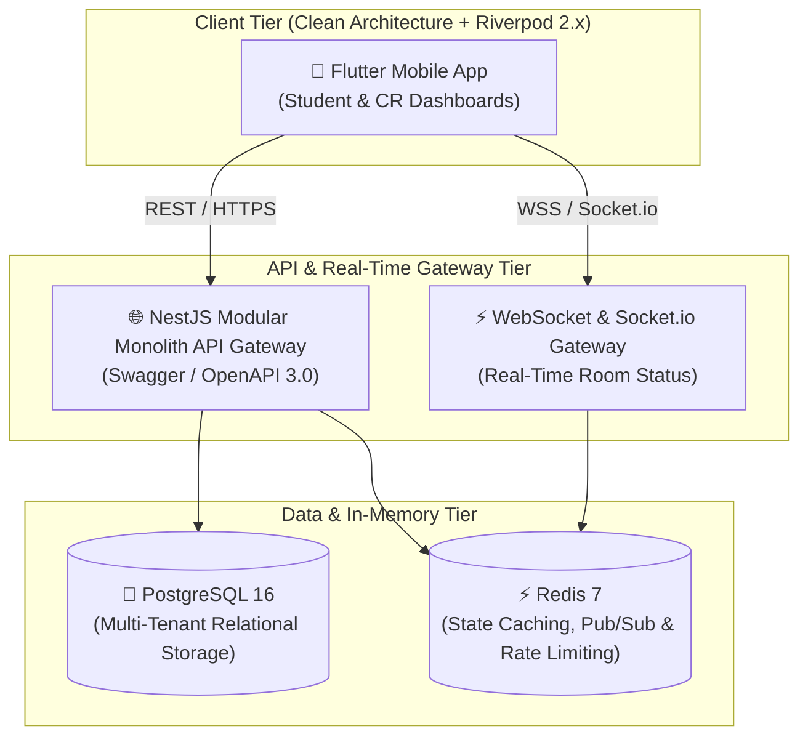

# UniRoom-Live 2.0 🏫🚀

[](docs/complete_project.md)
[](backend)
[](backend)
[](backend)
[](mobile)
[](docker-compose.yml)

> **Enterprise-Grade Multi-Tenant University Classroom & Timetable Orchestration Platform**  
> Engineered from first principles with **Clean Architecture**, **Domain-Driven Design (DDD)**, **Sub-Second Real-Time WebSockets**, and **Strict Role-Based Access Control (RBAC)**.

---

## 📚 Master Documentation Hub (`docs/`)

| Document | Purpose & Description | Link |
| :--- | :--- | :---: |
| **System Analysis** | Requirements, 4-Role RBAC, Edge Cases & $0 Strategy | [system_analysis.md](docs/system_analysis.md) |
| **System Design** | C4 Diagrams, Scale Math, Indexing & Top 10 Q&A | [system_design.md](docs/system_design.md) |
| **Distributed Systems Handbook** | Advanced Sharding, Kafka vs RabbitMQ, Raft & Free Courses | [future_system_design_handbook.md](docs/future_system_design_handbook.md) |
| **Project Master Blueprint** | Original System Charter, C4 Models & 5-Year Skill Mapping | [complete_project.md](docs/complete_project.md) |
| **Architecture Rationale** | Technical Decisions & Trade-Offs (English & বাংলা) | [architecture_rationale.md](project%20docs/architecture_rationale.md) |
| **Bengali Learning Guide** | টেকনোলজি বাছাইয়ের পেছনের গভীর কারণ (বাংলা গাইড) | [guide.md](docs/guide.md) |
| **Milestone 1 Guide** | Backend Core, Docker Infrastructure & Prisma Schema | [milestone_one.md](project%20docs/milestone_one.md) |
| **Execution Tasks Tracker** | Step-by-step implementation progress tracker (Task 1 to End) | [tasks.md](tasks.md) |

---

## 🏗️ System Architecture Overview



---

## 📂 Monorepo Structure

```
UniRoom-Live/
├── backend/                 # Enterprise NestJS + TypeScript API
│   ├── src/
│   │   ├── common/          # Guards, Interceptors, Decorators, Filters
│   │   ├── modules/
│   │   │   ├── auth/        # JWT, Refresh Rotation, Password Hashing, RBAC
│   │   │   ├── rooms/       # Room lifecycle, status & conflict engine
│   │   │   ├── schedules/   # Dynamic timetable allocation
│   │   │   └── realtime/    # WebSockets & Redis Pub/Sub gateway
│   │   └── database/        # Prisma migrations & schema
│   ├── test/                # Unit & E2E tests (Jest + Supertest)
│   └── Dockerfile           # Multi-stage production build
├── mobile/                  # Flutter 3.x Mobile Client
│   ├── lib/
│   │   ├── core/            # Dio network client, Result/Failure monads, tokens
│   │   ├── features/        # Auth, Rooms, University (Domain, Data, Presentation)
│   │   └── main.dart        # Riverpod ProviderScope root
│   └── test/                # Unit & Widget tests (mocktail)
├── docs/                    # Architecture Decision Records (ADRs) & C4 Diagrams
├── docker-compose.yml       # One-command orchestration (API + Postgres + Redis)
├── complete_project.md      # Full architecture blueprint & career roadmap
└── README.md
```

---

## ⚡ Quick Start (Local Development)

### 1. Prerequisites
- Docker & Docker Compose
- Node.js (v20+) & npm
- Flutter SDK (v3.22+)

### 2. Boot Infrastructure & Backend
```bash
# Clone the repository
git clone https://github.com/TanvirLogic/UniRoom-Live.git
cd UniRoom-Live

# Start PostgreSQL and Redis via Docker
docker compose up -d

# Interactive Swagger API Documentation:
# Open http://localhost:3000/api/docs in your browser
```

### 3. Run Mobile App
```bash
cd mobile
flutter pub get
flutter run
```

---

## 📜 License & Engineering Standards
Licensed under the [MIT License](LICENSE). Built adhering to Clean Architecture and modern Software Engineering standards.
