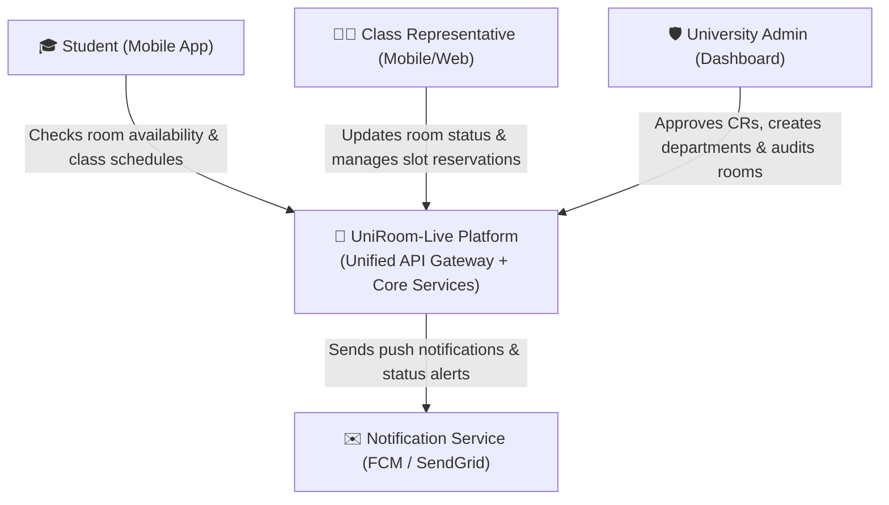
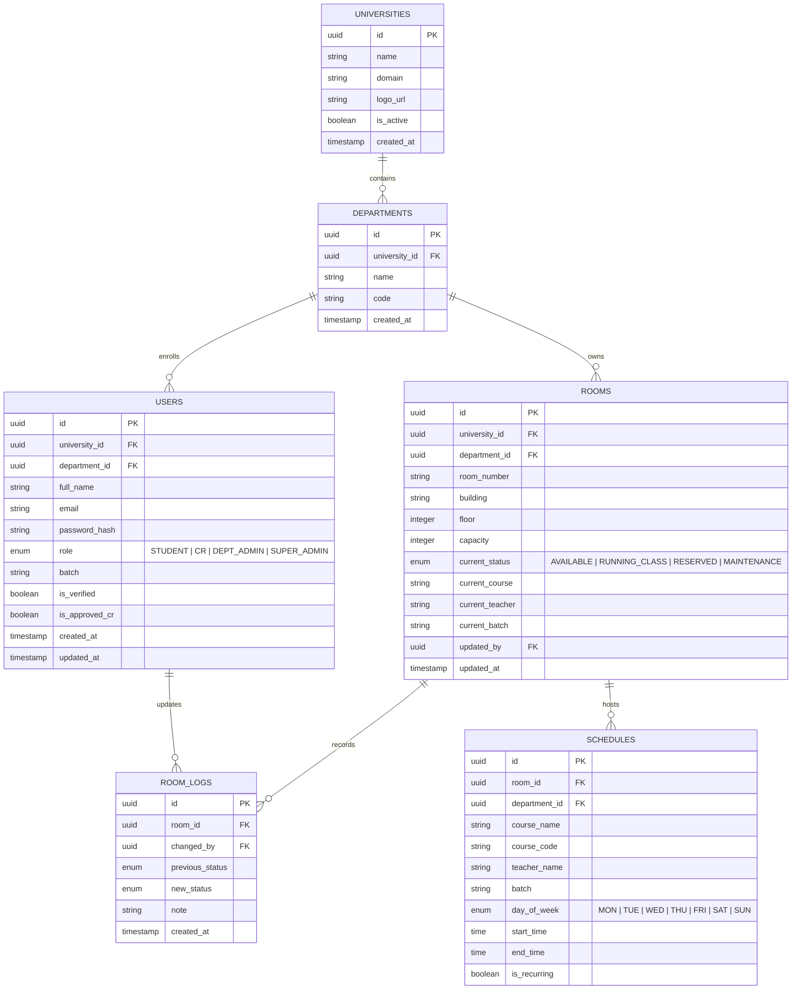
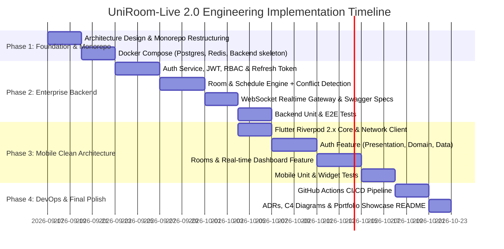

# UniRoom-Live 2.0: Enterprise Software Engineering Master Blueprint

---

## 1. Executive Summary & Vision

**UniRoom-Live 2.0** is an enterprise-grade, multi-tenant university classroom and schedule orchestration platform designed from first principles using modern Software Engineering (SWE) best practices.

This blueprint outlines the complete end-to-end architecture, domain models, backend microservices/modular monolith, mobile client, DevOps infrastructure, automated testing regimes, and engineering documentation needed to transform this repository into a **tier-1 CSE portfolio project (FAANG / high-growth unicorn standard)**.

### Primary Objectives
1. **Zero Compromise Architecture**: 100% adherence to Clean Architecture, Domain-Driven Design (DDD), and SOLID principles across frontend and backend.
2. **5-Year Job Security Skillset**: TypeScript/Node.js (NestJS) or Go, PostgreSQL, Redis, Docker, OpenAPI/Swagger, Riverpod 2.x, automated CI/CD pipelines, and end-to-end testing.
3. **High Scalability & Real-Time Performance**: Sub-second room availability synchronization using WebSockets, Redis Pub/Sub, and conflict-free booking state machines.
4. **Enterprise Security & Multi-Tenancy**: Strict tenant isolation, cryptographic Role-Based Access Control (RBAC), JWT authentication with secure refresh-token rotation, and rate-limiting.

---

## 2. 5-Year Tier-1 SWE Competency Matrix

This project is intentionally architected to demonstrate competencies tested in Mid-to-Senior Software Engineering and System Design interviews:

```
┌──────────────────────────────────────────────────────────────────────────────────┐
│                           5-YEAR SWE COMPETENCY STACK                           │
├───────────────────────┬───────────────────────────────┬──────────────────────────┤
│ Layer                 │ Enterprise Technology         │ Industry Value & Skills  │
├───────────────────────┼───────────────────────────────┼──────────────────────────┤
│ Mobile Architecture   │ Flutter + Riverpod 2.x        │ Unidirectional Data Flow │
│                       │ Clean Architecture (DDD)      │ Declarative State, Immut │
├───────────────────────┼───────────────────────────────┼──────────────────────────┤
│ Backend Engineering   │ Node.js (TypeScript / NestJS) │ Modular Monolith/Micro   │
│                       │ or Go (Fiber/Gin)             │ High concurrency, Clean  │
├───────────────────────┼───────────────────────────────┼──────────────────────────┤
│ Data & Persistence    │ PostgreSQL (Relational/ACID)  │ Normalized schemas, FKs  │
│                       │ Prisma ORM / GORM             │ Migrations, Indexes      │
├───────────────────────┼───────────────────────────────┼──────────────────────────┤
│ Caching & Real-Time   │ Redis (In-Memory + Pub/Sub)   │ Latency reduction, SSE/  │
│                       │ WebSockets (Socket.IO/ws)     │ WebSocket event streams  │
├───────────────────────┼───────────────────────────────┼──────────────────────────┤
│ DevOps & Infra        │ Docker & Docker Compose       │ Containerization, DevEx  │
│                       │ GitHub Actions CI/CD          │ Automated verification   │
├───────────────────────┼───────────────────────────────┼──────────────────────────┤
│ Quality Engineering   │ Jest / Supertest / Mocktail   │ Testing Trophy (Unit,    │
│                       │ Integration & E2E Testing     │ Integration, Mocking)    │
├───────────────────────┼───────────────────────────────┼──────────────────────────┤
│ API & Documentation   │ OpenAPI 3.0 / Swagger, C4     │ Contract-first API,      │
│                       │ Architecture Decision Records │ System Design literacy   │
└───────────────────────┴───────────────────────────────┴──────────────────────────┘
```

---

## 3. High-Level System Architecture (C4 Model)

### 3.1 Level 1: System Context Diagram



### 3.2 Level 2: Container Architecture Diagram

```mermaid
graph TD
    subgraph Client Layer
        FlutterApp["📱 Flutter Mobile Client (Riverpod 2.x + Clean Architecture)"]
        WebDashboard["💻 Flutter Web / Admin Portal"]
    end

    subgraph API & Gateway Layer
        Gateway["🌐 Reverse Proxy / API Gateway (Nginx or NestJS Gateway)"]
    end

    subgraph Core Backend Services (Dockerized)
        AuthService["🔑 Auth & Identity Service (JWT, RBAC, Passwords)"]
        RoomService["🚪 Room & Schedule Engine (Conflict Resolver, State Machine)"]
        NotificationEngine["🔔 Real-Time Event Gateway (WebSockets / Socket.io)"]
    end

    subgraph Storage Layer
        PostgresDB[("🐘 PostgreSQL 16\n(Multi-tenant Relational DB)")]
        RedisCache[("⚡ Redis 7\n(State Cache, Pub/Sub, Rate Limiting)")]
    end

    FlutterApp -->|REST API / HTTPS| Gateway
    FlutterApp -->|WebSocket / WSS| NotificationEngine
    WebDashboard -->|REST / WSS| Gateway

    Gateway --> AuthService
    Gateway --> RoomService
    Gateway --> NotificationEngine

    AuthService --> PostgresDB
    RoomService --> PostgresDB
    RoomService --> RedisCache
    NotificationEngine --> RedisCache
```

---

## 4. Database Schema & Entity Relationship Diagram (PostgreSQL)

The database design uses strict foreign key constraints, indexes on lookup paths, soft-deletion capabilities, and audit timestamps.



---

## 5. Backend Architecture & Engineering Standards

### 5.1 Technology Choice: NestJS + TypeScript (Enterprise Standard)
- **Why NestJS/TypeScript**: 
  - Standard enterprise modular architecture (Controllers, Services, Modules, Dependency Injection).
  - Native OpenAPI/Swagger generation directly from DTO decorators (`@ApiProperty`, `@IsNotEmpty`).
  - Native support for TypeORM / Prisma with automatic migration rollbacks.
  - Native WebSocket Gateways (`@WebSocketGateway`, `@SubscribeMessage`) connected to Redis adapters.
  - Enterprise middleware: Helmet (security headers), Rate-Limiter (Redis-backed), CORS, Global Exception Filters.

### 5.2 Folder Structure (Backend - Clean Architecture Modular Monolith)
```
backend/
├── src/
│   ├── common/                  # Cross-cutting concerns
│   │   ├── decorators/          # @CurrentUser(), @Roles(), @Public()
│   │   ├── exceptions/          # Custom Domain Exceptions & Filters
│   │   ├── guards/              # JwtAuthGuard, RolesGuard, TenantGuard
│   │   ├── interceptors/        # LoggingInterceptor, TransformInterceptor
│   │   ├── interfaces/          # IResult, IPaginatedResponse
│   │   └── pipes/               # ValidationPipe with class-validator
│   ├── config/                  # Type-safe environment configs
│   ├── database/                # Prisma migrations & seeders
│   │   └── schema.prisma
│   ├── modules/
│   │   ├── auth/                # Auth module (JWT, Register, Login, Refresh)
│   │   ├── universities/        # University & Department management
│   │   ├── rooms/               # Room lifecycle, status & conflict engine
│   │   ├── schedules/           # Timetable & recurring slot allocation
│   │   ├── realtime/            # WebSockets Gateway & Redis Pub/Sub
│   │   └── audit/               # Room change history logs
│   ├── app.module.ts
│   └── main.ts                  # Swagger bootstrap, ValidationPipe, CORS
├── test/                        # E2E & Integration tests (Supertest)
├── Dockerfile                   # Multi-stage production build
├── docker-compose.yml           # Backend + Postgres + Redis + PGAdmin
└── package.json
```

### 5.3 REST & WebSocket API Specification (OpenAPI 3.0 Standard)
- `POST /api/v1/auth/register` - Create user account (Student or CR candidate).
- `POST /api/v1/auth/login` - Authenticate, issuing Access Token (15m) + Refresh Token (7d).
- `POST /api/v1/auth/refresh` - Rotate refresh tokens securely (stored in Redis or HTTP-Only cookie).
- `GET /api/v1/rooms?departmentId=...` - Retrieve filtered rooms (cached in Redis for 30s).
- `PATCH /api/v1/rooms/:id/status` - CR/Admin update room state with optimistic locking.
- `POST /api/v1/rooms/:id/occupy` - Mark room as occupied with class info.
- `GET /api/v1/admin/pending-crs` - University Admin list of unapproved CRs.
- `PATCH /api/v1/admin/crs/:id/approve` - Approve CR privileges.
- `WS /socket.io` - Real-time channel broadcasting `room:updated`, `room:batch_changed`.

---

## 6. Frontend / Mobile Architecture (Flutter + Riverpod 2.x)

### 6.1 Clean Architecture Directory Layout
The mobile codebase is structured into feature-sliced Clean Architecture layers:

```
apps/mobile/lib/ (or lib/)
├── app/
│   ├── app.dart                 # Root MaterialApp widget
│   ├── app_router.dart          # GoRouter with redirect & auth guards
│   └── theme/                   # Material 3 Design System (Dark/Light tokens)
├── core/
│   ├── constants/               # API endpoints, asset paths, keys
│   ├── errors/                  # Failure classes & Exception mapping
│   │   ├── exceptions.dart
│   │   └── failures.dart        # ServerFailure, NetworkFailure, AuthFailure
│   ├── network/                 # Dio client + Auth Interceptors + Retry
│   │   ├── api_client.dart
│   │   └── token_interceptor.dart
│   ├── storage/                 # Secure storage (FlutterSecureStorage / Hive)
│   ├── usecases/                # Generic UseCase<Type, Params> interface
│   └── utils/                   # Result/Either functional monad, validators
├── features/
│   ├── auth/
│   │   ├── data/
│   │   │   ├── datasources/     # AuthRemoteDataSource, AuthLocalDataSource
│   │   │   ├── models/          # UserModel (JSON serialization)
│   │   │   └── repositories/   # AuthRepositoryImpl
│   │   ├── domain/
│   │   │   ├── entities/        # UserEntity (pure Dart)
│   │   │   ├── repositories/    # AuthRepository (abstract interface)
│   │   │   └── usecases/        # LoginUseCase, SignUpUseCase, LogoutUseCase
│   │   └── presentation/
│   │       ├── controllers/     # AuthNotifier (Riverpod AsyncNotifier)
│   │       ├── states/          # AuthState (unauthenticated, loading, authenticated)
│   │       └── screens/         # LoginScreen, SignUpScreen, PendingApprovalScreen
│   ├── rooms/
│   │   ├── data/                # RoomRemoteDataSource, RoomRepositoryImpl, RoomModel
│   │   ├── domain/              # RoomEntity, GetRoomsUseCase, UpdateRoomStatusUseCase
│   │   └── presentation/
│   │       ├── controllers/     # RoomListNotifier, RoomRealtimeNotifier
│   │       ├── widgets/         # RoomCard, StatusBadge, QuickStatusToggleModal
│   │       └── screens/         # StudentDashboardScreen, CRDashboardScreen
│   └── university/
│       ├── data/
│       ├── domain/
│       └── presentation/
└── main.dart                    # Entry point with ProviderScope
```

### 6.2 Riverpod 2.x State Management Pattern
- Uses `AsyncNotifier` / `Notifier` with immutability.
- No raw `setState` for business logic.
- UI reacts to `AsyncValue<T>` (`when(data: ..., loading: ..., error: ...)`).
- WebSocket streaming seamlessly piped into Riverpod `StreamProvider` or `AsyncNotifier`.

---

## 7. Quality Assurance & Automated Testing Trophy

Top engineering organizations require high test coverage across distinct layers:

```
             /\
            /  \      E2E Integration Tests (5-10%)
           /----\     - Full user flow: Login -> Switch Status -> Verify Realtime
          /      \
         /--------\   Widget & Component Tests (20-30%)
        /          \  - Screen rendering, forms, edge cases, error states
       /------------\
      /              \ Unit Tests (60-70%)
     /----------------\ - Use Cases, Repositories, Reducers/Notifiers, Models
```

### 7.1 Backend Testing Suite
- **Unit Tests (`*.spec.ts`)**:
  - Test business logic (Room conflict validator, JWT generation, password hashing).
  - Isolated with Jest and mocked repositories.
- **Integration & E2E Tests (`*.e2e-spec.ts`)**:
  - Spin up test database container or SQLite in-memory instance.
  - Test real HTTP endpoints via Supertest:
    - Register -> Login -> Issue token -> Access protected route.
    - CR status update -> verify database change and WebSocket event emission.

### 7.2 Mobile Testing Suite
- **Unit Tests**:
  - Test all Use Cases with `mocktail`.
  - Test Riverpod `Notifier` state emissions using `container.read()` and `listen()`.
- **Widget Tests**:
  - Test `RoomCard` displays correct badge colors for `AVAILABLE` vs `RUNNING_CLASS`.
  - Test `LoginForm` displays validation errors on invalid email.
- **Integration Tests (`integration_test/`)**:
  - Automated smoke test launching the application, executing authentication, and navigating through dashboard tabs.

---

## 8. DevOps, Docker & CI/CD Pipelines

### 8.1 Docker & Local Development Setup (`docker-compose.yml`)
One single command `docker compose up -d` boots:
1. `uniroom-db`: PostgreSQL 16 on port 5432 with volume persistence.
2. `uniroom-redis`: Redis 7 on port 6379 for caching and message pub/sub.
3. `uniroom-api`: NestJS backend on port 3000 with hot-reloading.
4. `uniroom-swagger`: Interactive OpenAPI docs available at `http://localhost:3000/docs`.

### 8.2 GitHub Actions CI Pipeline (`.github/workflows/ci.yml`)
Runs automatically on every Pull Request and Push to `main`:
1. **Backend Quality Gate**:
   - Install dependencies (`npm ci`).
   - Run linter & formatter check (`eslint`, `prettier --check`).
   - Run unit tests & integration tests with Jest.
   - Run typecheck (`tsc --noEmit`).
2. **Mobile Quality Gate**:
   - Set up Flutter stable.
   - Run `flutter analyze` with zero allowable warnings (`--fatal-infos`).
   - Run `flutter test --coverage`.
   - Verify build compilation (`flutter build apk --debug`).
3. **Automated Release**:
   - On Git tags (`v*.*.*`), automatically build production Android APK and Docker image for the backend.

---

## 9. Comprehensive Step-by-Step Implementation Roadmap



### Detailed Phase Breakdown:

#### Phase 1: Repository Restructuring & Environment Setup
- Organize repository into a clean monorepo structure:
  - `backend/`: Enterprise API service (Node.js/TypeScript NestJS, Prisma, Redis).
  - `mobile/`: Mobile client with Riverpod 2.x & Clean Architecture.
- Setup `docker-compose.yml` for zero-friction local development (Postgres 16, Redis 7).
- Setup strict `.editorconfig`, Git hooks (husky/lint-staged), and root scripts.

#### Phase 2: Backend Development (Full-Stack Engine)
- Database schema modeling in Prisma / SQL with migrations.
- Implementation of Authentication & RBAC (Student, CR, Admin).
- Room CRUD, real-time status toggling, and conflict checking logic.
- Redis Pub/Sub integration with Socket.io / WebSockets for live broadcasts.
- OpenAPI/Swagger auto-generation.
- Comprehensive unit tests & integration tests with Supertest.

#### Phase 3: Mobile Client Modernization (Flutter + Riverpod 2.x)
- Upgrade Flutter dependencies: `flutter_riverpod`, `riverpod_annotation`, `dio`, `go_router`, `freezed_annotation`.
- Build `core/` networking layer with automatic JWT token refresh interceptors.
- Build Domain Layer: pure Dart Entities, Use Cases, and Repository contracts.
- Build Data Layer: Remote Data Sources (Dio), Local Data Sources (Secure Storage), and Repository implementations.
- Build Presentation Layer: Riverpod `AsyncNotifier` controllers, reactive widgets, and clean Material 3 dark UI.
- Real-time WebSocket listener synchronizing room statuses without polling.

#### Phase 4: Testing, CI/CD & Documentation
- Write Flutter unit tests for Use Cases and Riverpod Notifiers using `mocktail`.
- Write widget tests for critical UI components.
- Configure GitHub Actions CI pipeline running automated lint, test, and build checks.
- Generate Architecture Decision Records (ADRs) and update the main documentation with C4 diagrams and API specifications.

---

## 10. Verification Plan

### Automated Checks
- `npm run test` & `npm run test:e2e` in `backend/`: 100% passing tests.
- `flutter analyze` in `mobile/`: 0 warnings, 0 errors.
- `flutter test`: 100% passing unit & widget tests.
- Docker: `docker compose up --build` boots all services healthy.

### Manual End-to-End Workflow Verification
1. **Multi-tenant Registration**: A student and a CR sign up under University "A", Department "CSE".
2. **Approval Flow**: Admin logs in, sees the pending CR, and approves them.
3. **Real-Time Room Management**:
   - The student has the app open on the Student Dashboard.
   - The CR opens the app, toggles Room 402 to "RUNNING_CLASS" (Course: "Algorithms", Teacher: "Dr. Smith").
   - **Verification**: The student's screen updates instantly via WebSocket without any manual refresh.
4. **Offline Resilience**: Turn on airplane mode; app shows cached room state gracefully without crashing.
