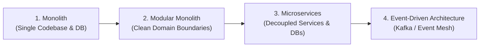
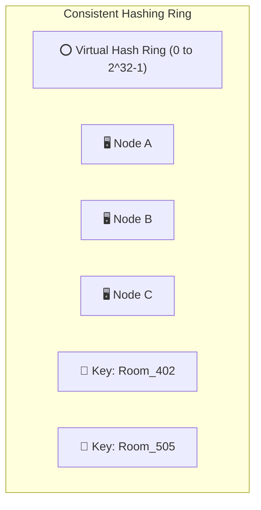
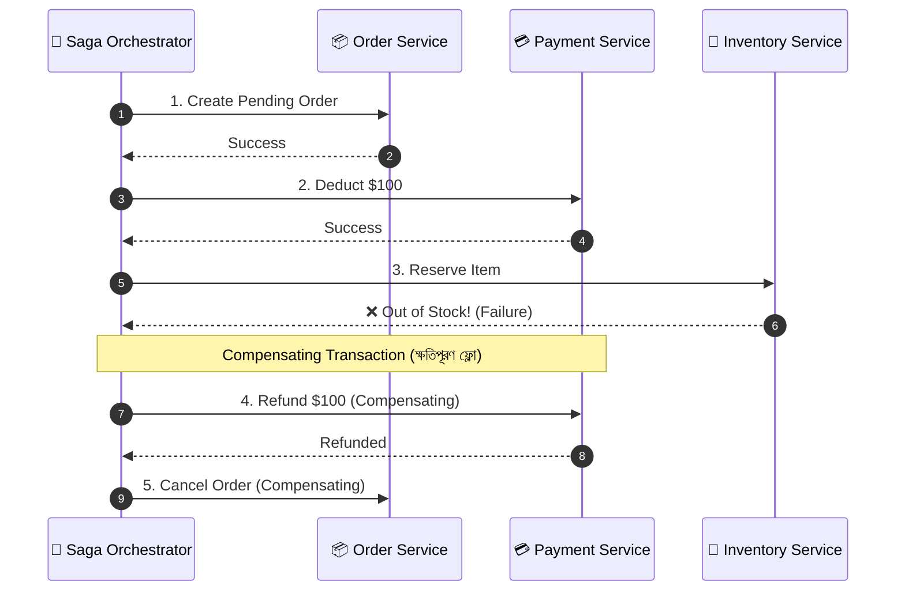

# The Ultimate 5-Year System Design & Enterprise Architecture Handbook 🌐📘

> **Authoritative Engineering Guide**: From Monolith to Hyperscale Distributed Systems  
> **Target Mastery**: FAANG, Tier-1 Tech Startups, Global Remote Senior SWE & System Design Interviews  
> **Career Lifespan**: Curated for high-impact relevance across **2025–2030**.

---

# সূচিপত্র (Table of Contents)
1. [আর্কিটেকচারাল প্যাটার্ন ও বিবর্তন (Architectural Paradigms)](#1-architectural-paradigms--evolution)
   - Monolith vs Modular Monolith vs Microservices vs Serverless
   - Strangler Fig Pattern (মনোলিথ ভাঙার কৌশল)
   - CQRS (Command Query Responsibility Segregation) ও Event Sourcing
2. [ডাটাবেজ সিস্টেম ডিজাইন ও স্কেলিং (Database Deep Dive)](#2-database-system-design--scaling)
   - SQL vs NoSQL vs NewSQL vs Vector Databases (কী কখন ব্যবহার করবেন?)
   - Database Sharding & Partitioning (Range, Hash, Directory-based)
   - Consistent Hashing (কনসিস্টেন্ট হ্যাশিং অ্যালগরিদম)
   - Read Replicas, Master-Slave ও Split-Brain সমস্যা
3. [হাই-স্কেল মেসেজিং ও ইভেন্ট স্ট্রিমিং (Distributed Messaging)](#3-distributed-messaging--streaming)
   - Message Queues (RabbitMQ/SQS) বনাম Distributed Logs (Kafka/Redpanda)
   - Idempotency & Exactly-Once Semantics (ডুপ্লিকেট মেসেজ রোধের কৌশল)
   - Dead Letter Queue (DLQ) ও Backpressure
4. [ডিস্ট্রিবিউটেড ট্রানজ্যাকশন ও কনসেনসাস (Distributed Transactions)](#4-distributed-transactions--consensus)
   - Two-Phase Commit (2PC) বনাম Saga Pattern (Choreography vs Orchestration)
   - Distributed Locking (Redis Redlock, ZooKeeper, etcd)
   - Raft & Paxos কনসেনসাস অ্যালগরিদম
5. [ক্যাশিংয়ের অন্ধকার দিক ও প্রতিরক্ষা (Advanced Caching Pitfalls)](#5-advanced-caching--anti-pitfall-strategies)
   - Cache Stampede / Thundering Herd Problem
   - Cache Penetration & Bloom Filter
   - Cache Avalanche & Probabilistic Early Expiration
6. [API প্রোটোকল যুদ্ধ (Modern API Communication Protocols)](#6-modern-api-communication-protocols)
   - REST vs GraphQL vs gRPC (HTTP/2 + Protobuf) vs WebSockets vs WebRTC
   - API Gateway, Circuit Breaker Pattern & Rate Limiting Algorithms
7. [অবজারভেবিলিটি, রেজিলিয়েন্স ও ডেপ্লয়মেন্ট (Observability & SRE)](#7-observability-sre--deployment-patterns)
   - The 3 Pillars: Metrics, Structured Logs & Distributed Tracing (OpenTelemetry)
   - Zero-Downtime Deployment: Blue-Green vs Canary vs Rolling Updates
8. [আগামী ৫ বছরের ট্রেন্ড (2025–2030 Emerging Tech)](#8-emerging-trends-for-the-next-5-years)
   - AI-Driven Systems: RAG (Retrieval-Augmented Generation) & Vector Search
   - Edge Computing & WebAssembly (Wasm)

---

## 1. Architectural Paradigms & Evolution



### ১.১ মনোলিথ বনাম মাইক্রোসার্ভিসেস (কখন কোনটা?)
- **ভুল ধারণা:** *"সব বড় কোম্পানি মাইক্রোসার্ভিসেস ব্যবহার করে, তাই শুরু থেকেই মাইক্রোসার্ভিসেস বানানো উচিত।"* (এটি ইন্টারভিউতে সবচেয়ে বড় রেড-ফ্ল্যাগ!)
- **সঠিক সিনিয়র ইঞ্জিনিয়ারিং উত্তর:**
  - **Modular Monolith (আমাদের UniRoom-Live 2.0 এর পছন্দ):** কোড থাকবে একটি রিপোজিটরিতে, কিন্তু প্রতিটি ডোমেইন (Auth, Rooms, Schedules) আলাদা মডিউল হিসেবে থাকবে। ডিপেন্ডেন্সি ইনজেকশন দিয়ে আলাদা থাকবে। 
    - *সুবিধা:* নেটওয়ার্ক লেটেন্সি নেই, ডিস্ট্রিবিউটেড ডিবাগিংয়ের যন্ত্রণা নেই, ডেভেলপমেন্ট দ্রুত হয়।
  - **Microservices কখন দরকার?**
    - যখন টিমের সাইজ ১০০+ ইঞ্জিনিয়ার হয়ে যায় এবং একেক টিম একেক সার্ভিসের মালিকানা নেয়।
    - যখন কোনো নির্দিষ্ট সার্ভিসে ট্রাফিক অন্য সার্ভিসের চেয়ে ১০০ গুণ বেশি হয় (যেমন: পেমেন্ট সার্ভিস বনাম সাধারণ ব্লগ সার্ভিস)।

### ১.২ Strangler Fig Pattern (মনোলিথ থেকে মাইক্রোসার্ভিসে উত্তরণ)
- একটি চলমান বড় মনোলিথিক সিস্টেমকে এক রাতে বন্ধ করে নতুন মাইক্রোসার্ভিস বানানো যায় না।
- **Strangler Fig Pattern:** একটি API Gateway বসিয়ে মনোলিথ থেকে আস্তে আস্তে একটি করে ফিচার (যেমন: প্রথমে `Notification Service`, তারপর `Auth Service`) কেটে নতুন সার্ভিসে রূপান্তর করা হয়, যতক্ষণ না পুরোনো মনোলিথ সম্পূর্ণ নিঃশেষ হয়।

### ১.৩ CQRS & Event Sourcing
- **CQRS (Command Query Responsibility Segregation):** ডাটা রাইট করার জন্য আলাদা অপটিমাইজড মডেল (Command) এবং ডাটা দ্রুত রিড করার জন্য আলাদা অপটিমাইজড ভিউ/ক্যাশ (Query) ব্যবহার করা।
- **Event Sourcing:** ডাটাবেজে বর্তমান স্টেট সেভ না করে ঘটা প্রতিটি ঘটনা (`RoomBookedEvent`, `RoomReleasedEvent`, `ClassCancelledEvent`) একটি ইমুটেবল লগ হিসেবে সেভ রাখা। ফলে অতীতে যেকোনো সেকেন্ডে সিস্টেমের কী অবস্থা ছিল তা টাইম-ট্রাভেল করে হুবহু রিক্রিয়েট করা যায় (ব্যাংকিং ও ফিনটেকের মূল আর্কিটেকচার)।

---

## 2. Database System Design & Scaling

### ২.১ SQL বনাম NoSQL বনাম NewSQL বনাম Vector DB

| ডাটাবেজ টাইপ | প্রতিনিধি | কখন ব্যবহার করবেন? (Use Case) |
| :--- | :--- | :--- |
| **Relational (RDBMS)** | **PostgreSQL, MySQL** | রিলেশনাল ডাটা, ACID ট্রানজ্যাকশন, আর্থিক লেনদেন, শিডিউলিং। |
| **Document (NoSQL)** | **MongoDB, CouchDB** | আনস্ট্রাকচার্ড স্কিমা, দ্রুত পরিবর্তনশীল প্রোটোটাইপ, কন্টেন্ট ম্যানেজমেন্ট (CMS)। |
| **Wide-Column (NoSQL)** | **Apache Cassandra, ScyllaDB** | বিশাল পরিমাণ রাইট ট্রাফিক (যেমন: IoT সেন্সর ডাটা, মেসেজিং চ্যাট লগ)। |
| **Key-Value (NoSQL)** | **Redis, DynamoDB** | সেশন স্টোর, রিয়েল-টাইম লিডারবোর্ড, সাব-মিলি-সেকেন্ড ক্যাশিং। |
| **NewSQL** | **CockroachDB, Google Spanner** | গ্লোবালি ডিস্ট্রিবিউটেড কিন্তু শক্তিশালী ACID কনসিস্টেন্সি দরকার। |
| **Vector DB** | **Pinecone, Milvus, pgvector** | AI / LLM প্রজেক্টে এম্বেডিংস মিলানো, সেমান্টিক সার্চ, ইমেজ রিকগনিশন। |

---

### ২.২ Database Sharding ও Consistent Hashing

যখন একটি ডাটাবেজ সার্ভারের হার্ডডিস্ক বা সিপিইউ ট্রাফিক সামলাতে পারে না, তখন ডাটা একাধিক সার্ভারে ভাগ করে দেওয়াকে **Sharding** বলে।

#### কনসিস্টেন্ট হ্যাশিং (Consistent Hashing) কেন সেরা?
- **সাধারণ Modulo Sharding এর সমস্যা:** `Server = Hash(UserID) % N` (যেখানে $N$ হলো সার্ভারের সংখ্যা)। যদি ১টি নতুন সার্ভার যোগ করা হয় ($N+1$), তবে প্রায় সব ডাটা ভুল সার্ভারে ম্যাপ করবে এবং বিশাল ক্যাশ ট্র্যাশিং হবে।
- **Consistent Hashing Solution:** সার্ভার এবং কী (Keys) একটি ভার্চুয়াল বৃত্তাকার রিংয়ে ($0$ থেকে $2^{32}-1$) অবস্থান করে। 
- নতুন সার্ভার যোগ বা রিমুভ করলে গড়ে মাত্র $\frac{1}{N}$ পরিমাণ ডাটা স্থানান্তরিত হয়। এটি **Discord, DynamoDB, Netflix, Uber** এর ব্যাকবোন!



---

## 3. Distributed Messaging & Event Streaming

```
┌────────────────────────────────────────────────────────────────────────────────────────┐
│                        MESSAGE QUEUE বনাম EVENT STREAMING                              │
├──────────────────────────┬─────────────────────────────────────────────────────────────┤
│ Message Queue (RabbitMQ) │ Distributed Commit Log (Kafka / Redpanda)                   │
├──────────────────────────┼─────────────────────────────────────────────────────────────┤
│ • মেসেজ কনজিউমার পড়ার পর │ • মেসেজ ডিস্কে পার্মানেন্টলি সংরক্ষিত থাকে (Log)।            │
│   মুছে যায় (Smart Broker)│ • একাধিক স্বতন্ত্র সার্ভিস নিজের মতো রিড করতে পারে।          │
│ • টাস্ক ডিস্ট্রিবিউশনের জন্য সেরা │ • হাই-থ্রুপুট ইভেন্ট স্ট্রিমিং ও অ্যানালিটিক্সের জন্য সেরা।│
└──────────────────────────┴─────────────────────────────────────────────────────────────┘
```

### ৩.১ Exactly-Once Semantics & Idempotency Key
- নেটওয়ার্ক কখনোই নিখুঁত নয়। একটি পেমেন্ট বা রুম বুকিং রিকোয়েস্ট পাঠানোর পর নেটওয়ার্ক টাইমআউট হতে পারে। ক্লায়েন্ট আবার রিকোয়েস্ট রিট্রাই করবে।
- **Idempotency Key (আইডেমপোটেন্সি):** প্রতি রিকোয়েস্টে ক্লায়েন্ট একটি ইউনিক UUID পাঠায় (`X-Idempotency-Key: uuid-v4`)।
- সার্ভার প্রথমে ক্যাশে চেক করে: এই কি দিয়ে কি অলরেডি প্রসেস হয়েছে? যদি হ্যাঁ, তবে নতুন করে চার্জ না কেটে পুরোনো সফল রেসপন্স ফিরিয়ে দেয়।

---

## 4. Distributed Transactions & Consensus

### ৪.১ টু-ফেজ কমিট (2PC) বনাম সাগা প্যাটার্ন (Saga Pattern)

মাইক্রোসার্ভিসে প্রতিটি সার্ভিসের নিজস্ব ডাটাবেজ থাকে। যখন অর্ডার সার্ভিস, ইনভেন্টরি সার্ভিস এবং পেমেন্ট সার্ভিসকে একসাথে সফল হতে হয়:



- **Saga Pattern:** কোনো সেন্ট্রাল লক ছাড়াই একেকটি সার্ভিস লোকাল ট্রানজ্যাকশন সম্পন্ন করে। কোনো ধাপে ফেইল করলে পূর্বের সব কাজের জন্য **ক্ষতিপূরণমূলক অ্যাকশন (Compensating Transactions)** চালিয়ে সিস্টেমকে আগের অবস্থায় ফিরিয়ে আনে।

---

## 5. Advanced Caching Pitfalls & Defenses

ইন্টারভিউতে ক্যাশ বানানোর চেয়ে ক্যাশ ফেল করলে কী হবে তা জিজ্ঞেস করা বেশি পছন্দের বিষয়:

### ৫.১ ক্যাশ স্ট্যাম্পিড / থান্ডারিং হার্ড (Cache Stampede / Thundering Herd)
- **ঘটনা:** একটি জনপ্রিয় কী (যেমন: ক্যাম্পাসের রুটিন) ঠিক সকাল ৯:০০ টায় এক্সপায়ার হয়ে গেল। ঐ সেকেন্ডে ১০,০০০ রিকোয়েস্ট ক্যাশে ডাটা না পেয়ে একযোগে পোস্টগ্রেস ডাটাবেজে হিট করল। ডাটাবেজ ক্র্যাশ!
- **প্রতিরক্ষা:**
  1. **Mutex Lock (Single-Flight):** প্রথম রিকোয়েস্টটি ডাটাবেজে যাবে এবং ক্যাশে লক বসাবে; বাকি ৯,৯৯৯টি রিকোয়েস্ট ক্যাশ পপুলেট হওয়া পর্যন্ত অপেক্ষা করবে।
  2. **Probabilistic Early Expiration (XFetch):** ক্যাশ সম্পূর্ণ মেয়াদ শেষ হওয়ার আগেই ব্যাকগ্রাউন্ডে নতুন ডাটা রিফ্রেশ করে নেওয়া।

### ৫.২ ক্যাশ পেনিট্রেশন (Cache Penetration)
- **ঘটনা:** হ্যাকার ইচ্ছে করে এমন রুম আইডি দিয়ে লাখ লাখ রিকোয়েস্ট পাঠাচ্ছে যা ডাটাবেজে নেই (`Room ID: -99999`)। ক্যাশে না পেয়ে প্রতিবার রিকোয়েস্ট ডাটাবেজে আঘাত করছে।
- **প্রতিরক্ষা:** **Bloom Filter** ব্যবহার করা। ব্লুম ফিল্টার হলো একটি মেমোরি-দক্ষ প্রবাবিলিস্টিক ডাটা স্ট্রাকচার যা ১০০% নিশ্চিত করে বলে দিতে পারে কোনো ডাটা ডাটাবেজে নেই কি না!

---

## 6. Modern API Protocols & Gateway Patterns

### ৬.১ gRPC বনাম REST
- **REST:** টেক্সট-বেসড JSON ব্যবহার করে, মানুষের পড়ার জন্য সহজ কিন্তু সাইজে বড় ও তুলনামূলক ধীর।
- **gRPC (Google Remote Procedure Call):** বাইনারি ফরম্যাট (**Protocol Buffers**), **HTTP/2 Multiplexing** ব্যবহার করে। REST এর চেয়ে **৭-১০ গুণ দ্রুত** এবং কম ব্যান্ডউইথ খরচ করে। মাইক্রোসার্ভিসগুলোর অভ্যন্তরীণ যোগাযোগের জন্য ইন্ডাস্ট্রি গোল্ড-স্ট্যান্ডার্ড!

### ৬.২ সার্কিট ব্রেকার প্যাটার্ন (Circuit Breaker Pattern)
- যদি নোটিফিকেশন সার্ভিস ডাউন হয়ে যায়, ব্যাকএন্ড বারবার কল পাঠিয়ে নিজের থ্রেড আটকে রাখবে না।
- **States:**
  - **CLOSED:** স্বাভাবিক অবস্থা।
  - **OPEN:** সার্ভিস ফেইল করতে থাকলে সাথে সাথে রিকোয়েস্ট ব্লক করে অলটারনেটিভ বা ফলব্যাক রেসপন্স দেয়।
  - **HALF-OPEN:** কিছু সময় পর অল্প কয়েকটি রিকোয়েস্ট পাঠিয়ে পরীক্ষা করে সার্ভিস সুস্থ হয়েছে কি না।

---

## 7. Observability, SRE & Zero-Downtime Deployment

```
┌────────────────────────────────────────────────────────────────────────────────────────┐
│                        OBSERVABILITY এর ৩টি স্তম্ভ (THE 3 PILLARS)                     │
├─────────────────────┬──────────────────────────────────────────────────────────────────┤
│ ১. Metrics          │ সংখ্যা ও কাউন্টার (CPU, Memory, RPS, p99 Latency) - Prometheus/  │
│                     │ Grafana                                                          │
├─────────────────────┼──────────────────────────────────────────────────────────────────┤
│ ২. Structured Logs  │ প্রতি ইভেন্টের নিখুঁত JSON লগ (TraceId, UserId, ErrorCode) - ELK │
├─────────────────────┼──────────────────────────────────────────────────────────────────┤
│ ৩. Distributed Trace│ একটি ইউজার ক্লিকে রিকোয়েস্ট কোন কোন সার্ভিসের মধ্য দিয়ে কত ms সময়│
│                     │ ব্যয় করল তার টাইমলাইন - OpenTelemetry / Jaeger                   │
└─────────────────────┴──────────────────────────────────────────────────────────────────┘
```

### ৭.১ ব্লু-গ্রিন বনাম ক্যানারি ডেপ্লয়মেন্ট (Zero Downtime)
- **Blue-Green:** দুটি হুবহু একই প্রোডাকশন এনভায়রনমেন্ট থাকে (Blue = লাইভ ভার্সন, Green = নতুন ভার্সন)। নতুন ভার্সন টেস্ট শেষে রাউটার দিয়ে ১ সেকেন্ডে ট্রাফিক গ্রিনে পাঠিয়ে দেওয়া হয়।
- **Canary Deployment:** নতুন রিলিজ প্রথমে মাত্র ৫% ইউজারের কাছে পাঠানো হয়। মেট্রিক্সে কোনো এরর না দেখলে ধীরে ধীরে ১০% ➔ ৫০% ➔ ১০০% ইউজারের কাছে পাঠানো হয়।

---

## 8. Emerging Trends for the Next 5 Years (2025–2030)

### ৮.১ AI-Driven Systems: RAG (Retrieval-Augmented Generation)
- শুধু চ্যাটবট নয়, আধুনিক সফটওয়্যারের সাথে নিজস্ব ডাটাবেজের জ্ঞান যুক্ত করতে RAG প্যাটার্ন ব্যবহৃত হয়।
- টেক্সটকে ভেক্টর এম্বেডিং বানিয়ে **Vector Database (pgvector / Pinecone)** এ রাখা হয় এবং কসিমিন সিমিলারিটি (Cosine Similarity) দিয়ে দ্রুত প্রাসঙ্গিক ডাটা খুঁজে LLM-কে কনটেক্সট দেওয়া হয়।

---

## 9. সম্পূর্ণ ফ্রি সিস্টেম ডিজাইন কোর্স ও ইউটিউব রিসোর্স হাব (The Ultimate Free System Design Hub) 🎥🎓

সিস্টেম ডিজাইন শেখার জন্য কোনো পেইড কোর্স কেনার প্রয়োজন নেই। ইন্টারনেটে বিশ্বের সেরা ইঞ্জিনিয়ার ও বিশ্ববিদ্যালয়গুলোর লেকচার সম্পূর্ণ ফ্রিতে পাওয়া যায়। নিচে সবচেয়ে ইফেক্টিভ রিসোর্সগুলো সাজিয়ে দেওয়া হলো:

### ৯.১ সেরা ফ্রি কমপ্লিট ভিডিও কোর্স (Full Comprehensive Courses)

1. **FreeCodeCamp: "System Design for Beginners Course" (YouTube)**
   - **সময়:** ৫+ ঘণ্টার ফুল কোর্স।
   - **কী শেখাবে:** Client-Server Architecture, Caching, Load Balancing, Database Sharding, Proxies, এবং Real-world Case Studies (TinyURL, YouTube design)।
   - **সার্চ কিওয়ার্ড:** `freeCodeCamp System Design Course for Beginners`

2. **NeetCode: "System Design for Beginners" (YouTube Playlist)**
   - **কেন সেরা:** অ্যানিমেশন ও কোড দিয়ে অত্যন্ত সহজ ভাষায় ডিস্ট্রিবিউটেড সিস্টেমসের কনসেপ্ট বুঝিয়ে দেওয়া হয়েছে।
   - **টপিকস:** Horizontal vs Vertical Scaling, Load Balancers, CDN, Caching, CAP Theorem, Message Queues।
   - **সার্চ কিওয়ার্ড:** `NeetCode System Design for Beginners Playlist`

3. **Gaurav Sen (GKCS): "System Design Master Playlist" (YouTube)**
   - **ইন্ডাস্ট্রি লেজেন্ড:** বিশ্বজুড়ে লক্ষ লক্ষ ইঞ্জিনিয়ার গুগল, মেটা ও অ্যামাজনের সিস্টেম ডিজাইন ইন্টারভিউ ক্র্যাক করেছেন এই প্লেলিস্ট দেখে।
   - **কী শেখাবে:** Consistent Hashing, Distributed Caching, Microservices, Database Sharding, Event Bus।
   - **সার্চ কিওয়ার্ড:** `Gaurav Sen System Design Playlist`

---

### ৯.২ বিশ্বসেরা ফ্রি অ্যাকাডেমিক কোর্স (MIT & Cambridge University)

1. **MIT 6.824: Distributed Systems (Prof. Robert Morris)**
   - **কেন দেখবেন:** এমআইটি-র অফিশিয়াল ফুল সেমিস্টার লেকচার। Raft Consensus Algorithm, MapReduce, ZooKeeper ও Fault-Tolerance এর ডিপ-ডাইভ জানতে এর চেয়ে সেরা রিসোর্স নেই।
   - **সার্চ কিওয়ার্ড:** `MIT 6.824 Distributed Systems YouTube`

2. **Martin Kleppmann's Distributed Systems Course (Cambridge University)**
   - **প্রভাষক:** *Designing Data-Intensive Applications (DDIA)* বইয়ের লেখক মার্টিন ক্লেপম্যানের নিজস্ব ভিডিও সিরিজ।
   - **সার্চ কিওয়ার্ড:** `Martin Kleppmann Distributed Systems Cambridge YouTube`

---

### ৯.৩ টপ ৫টি ইউটিউব চ্যানেল (প্রতিটি সফটওয়্যার ইঞ্জিনিয়ারের সাবস্ক্রাইব করা উচিত)

| চ্যানেল নাম | স্পেশালিটি ও গুরুত্ব |
| :--- | :--- |
| **১. ByteByteGo (Alex Xu)** | *System Design Interview* বইয়ের লেখকের চ্যানেল। ২-৫ মিনিটের চমৎকার অ্যানিমেশন দিয়ে জটিল সিস্টেম ডিজাইন কনসেপ্ট নিমেষে মাথায় গেঁথে দেয়। |
| **২. Hussein Nasser** | ব্যাকএন্ড ও নেটওয়ার্কিংয়ের মাস্টারক্লাস। PostgreSQL ইন্টারনালস, ডিস্ট্রিবিউটেড লক, gRPC, WebSockets ও কানেকশন পুলিংয়ের বাস্তব ডেমো। |
| **৩. Arpit Bhayani (Asli Engineering)** | গুগল ও অ্যামাজনের প্রাক্তন স্টাফ ইঞ্জিনিয়ার। B-Trees, LSM-Trees, Kafka Internals ও ডাটাবেজ কীভাবে নিজে কোড করে বানাতে হয় তা শেখায়। |
| **৪. Jordan has no life** | সিনিয়র ও স্টাফ ইঞ্জিনিয়ার লেভেলের সিস্টেম ডিজাইন ইন্টারভিউ প্রশ্ন ও রিয়েল প্রোডাকশন আর্কিটেকচার ব্রেকডাউন। |
| **৫. NeetCodeIO** | বিগিনার থেকে ইন্টারমিডিয়েট ফ্রেন্ডলি সিস্টেম ডিজাইন ও কোডিং ইন্টারভিউ প্রস্তুতি। |

---

### ৯.৪ কনসেপ্ট ভিত্তিক বেস্ট ইউটিউব লেকচার (Concept-by-Concept Guide)

যখন যে কনসেপ্টে খটকা লাগবে, ইউটিউবে এই সার্চ টার্মগুলো দিয়ে সার্চ করবেন:

1. **Consistent Hashing (কনসিস্টেন্ট হ্যাশিং):**
   - 🔍 `Gaurav Sen Consistent Hashing` অথবা `ByteByteGo Consistent Hashing`
2. **Kafka vs RabbitMQ (মেসেজ কিউ বনাম ইভেন্ট স্ট্রিম):**
   - 🔍 `Hussein Nasser Message Queue vs PubSub` অথবা `ByteByteGo Kafka vs RabbitMQ`
3. **Database Sharding & Partitioning:**
   - 🔍 `Hussein Nasser Database Sharding` অথবা `Gaurav Sen Database Sharding`
4. **Saga Pattern (ডিস্ট্রিবিউটেড ট্রানজ্যাকশন):**
   - 🔍 `ByteByteGo Saga Pattern Distributed Transactions`
5. **Cache Stampede & Bloom Filters:**
   - 🔍 `ByteByteGo Cache Stampede` এবং `ByteByteGo Bloom Filter`
6. **gRPC vs REST (HTTP/2 vs JSON):**
   - 🔍 `Hussein Nasser gRPC Crash Course`
7. **Optimistic vs Pessimistic Locking:**
   - 🔍 `Hussein Nasser Database Locking Optimistic vs Pessimistic`

---

### ৯.৫ অবশ্যই বুকমার্ক করার মতো ফ্রি ওপেন-সোর্স সাইট ও গিটহাব রিপোজিটরি

1. **The System Design Primer (GitHub - Donne Martin)**
   - গিটহাবে ২ লাখ ৮০ হাজারেরও বেশি স্টার পাওয়া বিশ্বের ১ নম্বর সিস্টেম ডিজাইন গাইড। ইন্টারঅ্যাক্টিভ ফ্ল্যাশকার্ড ও সম্পূর্ণ ফ্রি স্টাডি ম্যাটেরিয়াল।
   - লিঙ্ক: `https://github.com/donnemartin/system-design-primer`
2. **Architecture Notes (`architecturenotes.co`)**
   - ভিজ্যুয়াল ড্রয়িং ও ইনফোগ্রাফিক দিয়ে Redis, Caching, DNS এবং কানেকশন পুলিং শেখার চমৎকার ফ্রি ব্লগ।
3. **ByteByteGo Free Newsletter (`blog.bytebytego.com`)**
   - নেটফ্লিক্স, উবার, ইউটিউব, হোয়াটসঅ্যাপ কীভাবে কাজ করে তার ফ্রি উইকলি আর্কিটেকচারাল ব্রেকডাউন।

---

> 🎓 **সমাপ্তি নোট**: এই হ্যান্ডবুক এবং উল্লেখিত ফ্রি রিসোর্সগুলো নিয়মিত অনুশীলন করলে সিস্টেম ডিজাইন নিয়ে আপনার আর কোনো ভয় থাকবে না, এবং যেকোনো গ্লোবাল টেক কোম্পানিতে আপনি একজন দক্ষ আর্কিটেক্ট হিসেবে ইন্টারভিউ দিতে পারবেন!
