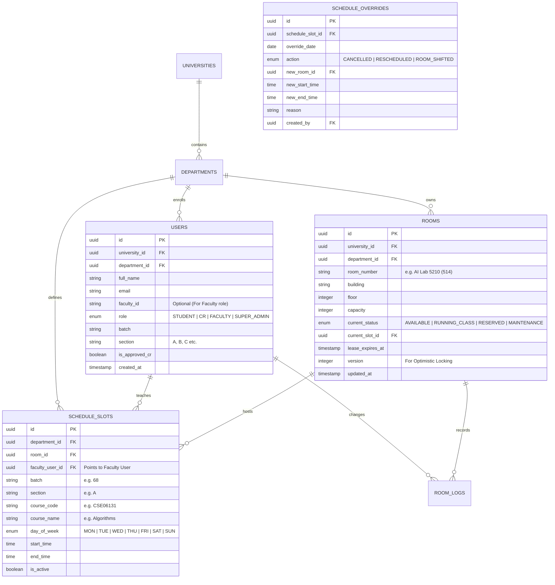

# UniRoom-Live 2.0: System Analysis & Requirements Engineering Document 📋🔍

> **Document Version**: 1.3.0 (Smart AI Timetable Ingestion & Multi-Role Ecosystem)  
> **Status**: Living Architectural Specification & Analysis  
> **Target Audience**: Product Owners, System Architects, Full-Stack Engineers, Recruiters/Interviewers  
> **Hosting Cost Strategy**: **100% Free / Zero-Dollar Tier ($0/month)** across development, testing, email, push notifications, and cloud deployment.

---

## ১. প্রজেক্টের ধারণা ও সমস্যা বিশ্লেষণ (Problem Statement & Value Proposition)

### ১.১ বাস্তব জীবনের সমস্যা (Real-World Problem)
বিশ্ববিদ্যালয় ক্যাম্পাসগুলোতে (পাবলিক ও প্রাইভেট) ক্লাসরুম সংকট এবং শিডিউল অব্যবস্থাপনা নিত্যদিনের বাস্তব চিত্র:
1. **রুম খোঁজার ভোগান্তি:** শিক্ষক বা শিক্ষার্থীরা ক্লাস নেওয়ার জন্য খালি রুম খুঁজতে ক্যাম্পাস ঘুরে ঘুরে সময় নষ্ট করেন।
2. **ডাবল বুকিং ও কনফ্লিক্ট:** একই সময়ে দুটি ভিন্ন ব্যাচ বা দুজন শিক্ষক একই রুমে গিয়ে হাজির হন, ফলে বিশৃঙ্খলা সৃষ্টি হয়।
3. **কমিউনিকেশন গ্যাপ:** ক্লাস প্রতিনিধি (CR) মেসেঞ্জার বা হোয়াটসঅ্যাপ গ্রুপে টেক্সট দেন, যা মেসেজের ভিড়ে হারিয়ে যায়।
4. **মানুষের ভুলে যাওয়া (Human Forgetfulness):** CR ক্লাসের পর রুম 'ফ্রি' করতে ভুলে যায়, ফলে বাস্তবে রুম খালি থাকলেও অ্যাপে 'Occupied' দেখায়।
5. **শিক্ষকদের শিডিউল জটিলতা (Faculty Routine Fragmentation):** একজন শিক্ষককে ৪-৫টি ভিন্ন ভিন্ন ব্যাচ ও সেকশনের ক্লাস নিতে হয়। প্রতিদিন কোন ব্যাচের ক্লাস কোন রুমে কয়টায়, তা ডায়েরি বা নোটিশ দেখে বের করা চরম বিরক্তিকর।
6. **রুটিনের ঘনঘন পরিবর্তন:** ডিপার্টমেন্টের মূল রুটিন সেমিস্টার জুড়ে কার্যকর থাকে না; প্রায় প্রতিদিনই শিক্ষক বা CR-কে ক্লাস রিশিডিউল, ক্যানসেল বা মেক-আপ ক্লাস নিতে হয়।
7. **ম্যানুয়াল ডাটা এন্ট্রির ক্লান্তি (Manual Routine Entry Nightmare):** ডিপার্টমেন্ট যখন `aSc Timetables` থেকে ৫-১০ পৃষ্ঠার বিশাল PDF রুটিন প্রকাশ করে, শত শত ক্লাসের ডাটা অ্যাপে টাইপ করে ইনপুট দেওয়া কোনো মানুষের পক্ষে বাস্তবসম্মত নয়।

### ১.২ সমাধান (Our Solution - UniRoom-Live 2.0)
UniRoom-Live 2.0 একটি **সম্পূর্ণ সমন্বিত (Fully Integrated) মাল্টি-টেন্যান্ট ক্লাসরুম ও শিডিউল অর্কেস্ট্রেশন প্ল্যাটফর্ম**। এটি রিয়েল-টাইম কনকারেন্সি হ্যান্ডলিং, ইভেন্ট-ড্রিভেন আর্কিটেকচার এবং ইন্টেলিজেন্ট অটোমেশন ব্যবহার করে:
- **ডিপার্টমেন্টের PDF রুটিন অটো-ইনজেস্ট:** সরাসরি PDF আপলোড করে অথবা এক্সটার্নাল এআই থেকে পাওয়া JSON পেস্ট করে ১০ সেকেন্ডে পুরো সেমিস্টারের সব ব্যাচের ক্লাস পোস্টগ্রেস ডাটাবেজে রূপান্তর।
- **স্টুডেন্টদের জন্য:** ১ ক্লিকে নিজ সেকশনের আজকের লাইভ রুটিন ও খালি রুমের সন্ধান।
- **CR-দের জন্য:** নিজ সেকশনের রুটিন পরিচালনা, মেক-আপ ক্লাস বুকিং এবং জরুরি রুম শিফটিং।
- **শিক্ষক/মেন্টরদের জন্য:** কোনো ম্যানুয়াল টাইপিং ছাড়াই অটো-জেনারেটেড পারসোনালাইজড ক্লাস শিডিউল ও পুশ নোটিফিকেশন।
- **অ্যাডমিনের জন্য:** ডিপার্টমেন্টের ক্লাসরুম ইউটিলাইজেশন এবং CR অনুমোদন পর্যবেক্ষণ।

### ১.৩ ইউনিভার্সাল মাল্টি-টেন্যান্ট SaaS আর্কিটেকচার (Multi-Tenant SaaS for Any University)
**UniRoom-Live 2.0 কোনো একক বিশ্ববিদ্যালয়ের জন্য হার্ডকোডেড নয়—এটি একটি গ্লোবাল মাল্টি-টেন্যান্ট প্ল্যাটফর্ম (SaaS):**
- **যেকোনো বিশ্ববিদ্যালয় নিজস্ব টেন্যান্ট খুলতে পারবে:** ঢাকা বিশ্ববিদ্যালয়, বুয়েট, উত্তরা বিশ্ববিদ্যালয়, ব্র্যাক, এনএসইউ বা বিদেশের যেকোনো বিশ্ববিদ্যালয় এই প্ল্যাটফর্মে স্বাধীনভাবে যুক্ত হতে পারবে।
- **হায়ারার্কিকাল অর্গানাইজেশন স্ট্রাকচার:**
  ```
  Global SaaS Platform (UniRoom-Live 2.0)
     └── University Tenant (উদা: Uttara University, BUET, DU)
            ├── Departments (উদা: CSE, EEE, BBA, Civil, Law)
            │      ├── Facilities: Buildings, Floors, Classrooms, Lab Rooms
            │      ├── Academic Units: Batches (68, 67, ...), Sections (A, B, C, ...)
            │      ├── Timetable Engine: Custom Slot Durations (80m, 90m, or 60m)
            │      └── User Base: Students, Section CRs, Faculty Members, Dept Admins
  ```
- **কঠোর ডাটা আইসোলেশন (Zero Cross-Tenant Bleed):** 
  - প্রতিটি ডাটাবেজ টেবিলে ক্রিপ্টোগ্রাফিক ফরেন কি `university_id` এবং `department_id` যুক্ত থাকবে।
  - ব্যাকএন্ডের **`TenantGuard`** নিশ্চিত করবে যে এক বিশ্ববিদ্যালয়ের কোনো ব্যবহারকারী বা অ্যাডমিন কখনোই অন্য কোনো বিশ্ববিদ্যালয়ের ডাটা এক্সেস বা প্রভাবিত করতে পারবে না।
  - প্রতিটি বিশ্ববিদ্যালয় তাদের নিজস্ব লোগো, ডিপার্টমেন্ট তালিকা এবং ক্লাসের সময়সূচী স্বাধীনভাবে পরিচালনা করবে।

---

## ২. স্টেকহোল্ডার ও ইউজার পারসোনা (Actors & RBAC Matrix)

```
┌─────────────────────────────────────────────────────────────────────────────────────────┐
│                                 RBAC PERMISSIONS MATRIX                                 │
├───────────────────────┬─────────────┬─────────────┬─────────────┬───────────────────────┤
│ Capabilities / Action │ Student     │ Approved CR │ Faculty     │ Super Admin           │
├───────────────────────┼─────────────┼─────────────┼─────────────┼───────────────────────┤
│ View Rooms & Status   │ ✅ (Own Dept)│ ✅ (All Uni) │ ✅ (All Uni) │ ✅ (All Tenants)      │
│ "My Routine Today"    │ ✅ (Sec/Batch)│ ✅ (Sec/Batch)│ ✅ (Aggregated)│ ✅ (All Tenants)   │
│ Ingest Master Routine │ ❌          │ ❌          │ ❌          │ ✅ (Full Authority)   │
│ (PDF / AI / JSON)     │             │             │             │                       │
│ Daily Class Override  │ ❌          │ ✅ (Own Sec) │ ✅ (Own Class)│ ✅                  │
│ 1-Click Cancel/Shift  │ ❌          │ ✅ (Own Sec) │ ✅ (Own Class)│ ✅                  │
│ 1-Tap "Find Room"     │ ✅          │ ✅          │ ✅          │ ✅                    │
│ QR Code Scan/Claim    │ ✅ (Verify)  │ ✅ (Claim)   │ ✅ (Claim)   │ ✅                    │
│ Add / Edit Rooms      │ ❌          │ ❌          │ ❌          │ ✅                    │
│ Approve CR (Email/UI) │ ❌          │ ❌          │ ❌          │ ✅ (1-Click)          │
│ Manage Universities   │ ❌          │ ❌          │ ❌          │ ✅                    │
│ View Audit History    │ ❌          │ ✅ (Recent)  │ ✅ (Recent)  │ ✅ (Full System)      │
└───────────────────────┴─────────────┴─────────────┴─────────────┴───────────────────────┘
```

---

## ৩. ফাংশনাল রিকোয়ারমেন্টস (Functional Requirements - FRs)

### FR-1: মাল্টি-টেন্যান্ট অথেনটিকেশন ও অ্যাকাউন্ট লাইফসাইকেল
- ব্যবহারকারী বিশ্ববিদ্যালয়, ডিপার্টমেন্ট, ব্যাচ ও সেকশন সিলেক্ট করে সাইন-আপ করবে।
- শিক্ষকরা সাইন-আপ করবেন তাদের অফিসিয়াল **Faculty ID / Code** (যেমন: `FAC-CSE-102`) দিয়ে।
- পাসওয়ার্ড `bcrypt` (12 rounds) দিয়ে হ্যাশ হবে; JWT Access Token (15m) + Refresh Token (7d) রোটেশন থাকবে।

### FR-2: ট্রানজ্যাকশনাল ইমেইল নোটিফিকেশন ইঞ্জিন (CR Approval Workflow)
- **CR সাইন-আপ অ্যালার্ট:** কোনো শিক্ষার্থী CR হিসেবে আবেদন করলে সুপার অ্যাডমিনের ইমেইলে সুরক্ষিত **1-Click "Approve" / "Reject"** লিঙ্ক চলে যাবে এবং অ্যাডমিন প্যানেলে পেন্ডিং লিস্টে দেখাবে।
- **স্বয়ংক্রিয় এক্টিভেশন ইমেইল:** অ্যাডমিন ক্লিক করলেই CR-এর ইমেইলে কনফার্মেশন ও দায়িত্বের নির্দেশিকা পৌঁছাবে।
- **প্রযুক্তি (১০০% ফ্রি):** Resend API (মাসে ৩,০০০ ফ্রি ইমেইল) অথবা Nodemailer + Gmail SMTP।

### FR-3: মাল্টি-চ্যানেল পুশ নোটিফিকেশন ইঞ্জিন (FCM Topics & Targeted Pushes)
- **ব্যাচ ও সেকশন টপিক ব্রডকাস্ট (`topics: dept_{id}_batch_{id}_sec_{id}`):**
  - শিক্ষক বা CR ক্লাস বাতিল বা রুম শিফট করলে ঐ নির্দিষ্ট সেকশনের সব স্টুডেন্টের মোবাইলে লাইভ পুশ যাবে: *"🚨 অ্যালগরিদম ক্লাস রুম ৪০২ থেকে ৫০৫-এ স্থানান্তরিত হয়েছে!"*
- **শিক্ষক/ফ্যাকাল্টি ক্লাস রিমাইন্ডার:** ক্লাস শুরুর ১৫ মিনিট আগে শিক্ষকের ফোনে অ্যালার্ট যাবে: *"স্যার, সকাল ৯টায় রুম ৪০২-এ ব্যাচ ৫২ (সেকশন A) এর সাথে আপনার Algorithms ক্লাস রয়েছে।"*
- **CR স্মার্ট লিজ রিমাইন্ডার:** ক্লাস শেষ হওয়ার ১০ মিনিট আগে CR-এর ফোনে নোটিফিকেশন: *"ক্লাস কি আর ১০ মিনিটে শেষ হচ্ছে? ১৫ মিনিট বাড়াবেন নাকি রুম রিলিজ করবেন?"*
- **প্রযুক্তি (১০০% ফ্রি):** Google Firebase Cloud Messaging (FCM) - ১০০% আনলিমিটেড ফ্রি।

### FR-4: ডিপার্টমেন্ট ➔ ব্যাচ ➔ সেকশন ভিত্তিক রুটিন ম্যানেজমেন্ট (CR-Maintained)
- সেকশনের CR তার ক্লাসের সাপ্তাহিক মূল রুটিন (Master Routine: বার, সময়, কোর্স, শিক্ষক কোড, রুম) এন্ট্রি ও রক্ষণাবেক্ষণ করবে।
- **Master Schedule বনাম Daily Override:**
  - স্থায়ী রুটিন বারবার এডিট করতে হবে না।
  - CR শুধু আজকের জন্য **"Cancel Today's Class"**, **"Reschedule Slot"**, বা **"Book Make-up Class"** করতে পারবে।
  - আজকের দিন পার হয়ে গেলে সিস্টেম স্বয়ংক্রিয়ভাবে আবার মূল সাপ্তাহিক রুটিনে ফিরে যাবে।

### FR-5: স্বয়ংক্রিয় ফ্যাকাল্টি / মেন্টর ড্যাশবোর্ড (Automated Faculty Schedule Aggregation)
- **শিক্ষকদের কোনো ম্যানুয়াল ডাটা এন্ট্রি করতে হবে না:**
  - বিভিন্ন সেকশন ও ব্যাচের CR যখন রুটিন এন্ট্রি করার সময় সংশ্লিষ্ট শিক্ষকের **Faculty ID** ট্যাগ করবে, ব্যাকএন্ড স্বয়ংক্রিয়ভাবে সেই ডাটা অ্যাগ্রিগেট করবে।
  - শিক্ষক তার আইডি দিয়ে লগইন করলেই দেখতে পাবেন তার আজকের সব ক্লাসের পারসোনালাইজড টাইমলাইন।
- **শিক্ষকের ১-ক্লিক অ্যাকশন:** শিক্ষক চাইলে অ্যাপ থেকে নিজেই আজকের ক্লাস বাতিল করতে পারেন বা রুম রিলিজ করতে পারেন।

### FR-6: সুপার অ্যাডমিন নিয়ন্ত্রিত ডুয়াল-মোড রুটিন ইনজেশন ইঞ্জিন (Super-Admin Controlled Routine Ingestion Engine) 🚀
প্রাতিষ্ঠানিক একাডেমিক পলিসি ও ডাটা ইন্টিগ্রিটি অক্ষুণ্ণ রাখতে সেমিস্টারের মূল মাস্টার রুটিন আপলোড বা ইনজেস্ট করার একক ক্ষমতা **শুধুমাত্র Super Admin**-এর থাকবে। কোনো শিক্ষার্থী বা সাধারণ CR পুরো সেমিস্টারের মূল রুটিন পরিবর্তন করতে পারবে না; CR-দের দায়িত্ব থাকবে নিজ সেকশনের দৈনিক মেক-আপ বা জরুরি রুম শিফট ম্যানেজ করা।

```mermaid
graph TD
    subgraph "Super Admin Authority"
        AdminUser[🛡️ Super Admin]
    end

    subgraph "Mode A: Built-in Direct AI Parser"
        AdminUser -->|Upload PDF| PDF[📄 Official Timetable PDF]
        PDF --> BuiltinAI[🧠 Gemini 2.0 Flash API (Free Tier)]
        BuiltinAI --> JSON_A[Strict Structured JSON]
    end

    subgraph "Mode B: External AI Prompt + JSON Uploader"
        AdminUser -->|1-Click Prompt| PromptBtn[📋 Copy AI Prompt Template]
        PromptBtn --> ExtAI[🤖 ChatGPT / Claude / DeepSeek]
        ExtAI --> PasteBox[📝 Paste JSON / Upload .json File]
        PasteBox --> JSON_B[Strict Structured JSON]
    end

    JSON_A --> Validator[🛡️ Zod Schema Validator & Tenant Guard]
    JSON_B --> Validator

    Validator --> Preview[👁️ Super Admin Interactive Review & Edit Table]
    Preview -->|Confirm & Ingest| DB[🐘 PostgreSQL Bulk Hydration]
```

1. **Mode A (Direct In-App AI Parsing - Free Gemini Flash):**
   - সুপার অ্যাডমিন সরাসরি রুটিনের PDF (যেমন: `aSc Timetables` এর ৫ পৃষ্ঠার ফাইল) অ্যাডমিন প্যানেলে আপলোড করবেন।
   - ব্যাকএন্ডের ফ্রি জেমিনি ফ্ল্যাশ ইঞ্জিন পুরো গ্রিড টেবিল পার্স করে স্ট্রাকচার্ড JSON তৈরি করবে।
2. **Mode B (External AI Prompt + JSON Uploader / Paste):**
   - সুপার অ্যাডমিন যদি চ্যাটজিপিটি বা ক্লড দিয়ে রুটিন পার্স করাতে চান:
     - অ্যাডমিন প্যানেলে একটি **"Copy Prompt for ChatGPT/Claude"** বাটন থাকবে।
     - সুপার অ্যাডমিন যেকোনো এআই থেকে পাওয়া JSON কোডটি পেস্ট বা `.json` ফাইল আপলোড করবেন।
3. **কঠোর স্কিমা ভ্যালিডেশন ও সিকিউরিটি গার্ড (Security & Tenant Guard):**
   - ব্যাকএন্ড `zod` বা `class-validator` দিয়ে চেক করবে ডাটার ফরম্যাট ১০০% সঠিক কি না।
   - ব্যাকএন্ডের **AdminGuard** নিশ্চিত করবে যে শুধুমাত্র অনুমোদিত Super Admin ছাড়া আর কেউ এই এন্ডপয়েন্টে হিট করতে পারবে না (HTTP 403 Forbidden for CR/Students)।
4. **ইন্টারেক্টিভ প্রিভিউ ও হাইড্রেশন (Preview & Entity Hydration):**
   - ডাটাবেজে সেভ হওয়ার আগে সুপার অ্যাডমিন স্ক্রিনে একটি প্রিভিউ টেবিল দেখতে পাবেন (কোনো বানান বা রুম নম্বর এডিট করা যাবে)।
   - **"Confirm & Ingest"** চাপলেই মাত্র ১ সেকেন্ডে সব রুম, ফ্যাকাল্টি ম্যাপিং এবং শত শত শিডিউল স্লট ডাটাবেজে ইনসার্ট হয়ে যাবে!

### FR-7: ইন্টেলিজেন্ট অটো-রিলিজ রুম লিজ (Smart Room Leases)
- ক্লাস শেষ হলে CR বা শিক্ষক যদি ম্যানুয়ালি রুম রিলিজ করতে ভুলেও যান, ব্যাকএন্ডের **Redis TTL / Cron Engine** স্বয়ংক্রিয়ভাবে রুমটিকে `AVAILABLE` করে দেবে।

### FR-8: "ফাইন্ড মি এ ফ্রি রুম নাও" রিকমেন্ডার (Smart 1-Tap Search)
- শিক্ষার্থী বা শিক্ষক হোমপেজে ১-ক্লিকে বর্তমান সময়ে খালি থাকা সেরা রুম খুঁজে নিতে পারবেন।

### FR-9: কিউআর কোড ডোর-চেকইন (Physical-to-Digital Bridge)
- প্রতিটি ক্লাসরুমের দরজায় প্রিন্ট করা কিউআর কোড থাকবে (`uniroom.live/r/:room_id`)। দরজায় স্ক্যান করে **"1-Tap Claim / Report Empty"** করা যাবে।

---

## ৪. নন-ফাংশনাল রিকোয়ারমেন্টস (Non-Functional Requirements - NFRs)

```
┌─────────────────────────────────────────────────────────────────────────────────┐
│                           NON-FUNCTIONAL SPECIFICATIONS                         │
├───────────────────────┬───────────────────────────────┬─────────────────────────┤
│ NFR Metric            │ Target Benchmark              │ Technical Implementation│
├───────────────────────┼───────────────────────────────┼─────────────────────────┤
│ Latency (Real-time WS)│ < 200 ms                      │ Redis Pub/Sub + WS      │
│ Ingestion Speed (JSON)│ < 1.5 seconds for 500 slots   │ Postgres Bulk Insert Tx │
│ Ingestion Speed (AI)  │ < 6.0 seconds per page        │ Gemini Flash Async      │
│ Push Notification Lat │ < 2.5 seconds                 │ FCM HTTP v1 Engine      │
│ Email Delivery Speed  │ < 5.0 seconds                 │ Resend / Async Worker   │
│ Latency (REST API)    │ < 50 ms (Cached), < 150ms (DB)│ Redis In-memory caching │
│ Concurrency & ACID    │ Zero Double Booking           │ Postgres Serializable Tx│
│ Availability          │ 99.9% Uptime                  │ Dockerized Micro-engine │
│ Code Quality Gate     │ 0 Lint Errors, >80% Test Cov  │ GitHub Actions CI       │
└───────────────────────┴───────────────────────────────┴─────────────────────────┘
```

---

## ৫. ডাটাবেজ মডেলিং ও রিলেশনশিপস (Updated for Faculty & Sections)



---

## ৫.১ রিয়েল-ওয়ার্ল্ড ক্যাম্পাস অপারেশন ও মোবাইল পারফরম্যান্স ইঞ্জিনিয়ারিং ⚙️📱

### ১. মাল্টি-ক্যাম্পাস ও ভবন সনাক্তকরণ (Multi-Campus & Building Disambiguation)
- প্রতিটি রুমের সাথে সুনির্দিষ্টভাবে `campus_name`, `building_name`, এবং `floor_number` যুক্ত থাকবে।
- যেমন: *"Permanent Campus - Building B, 5th Floor - AI Lab 5210"*। এর ফলে কোনো শিক্ষার্থী বা শিক্ষক ভুল ক্যাম্পাস বা ভবনে গিয়ে সময় নষ্ট করবেন না।

### ২. ডাইনামিক কাজের দিন (Configurable Operational Days per University)
- বিশ্ববিদ্যালয়ের ধরন অনুযায়ী কাজের দিন কনফিগার করা যাবে:
  - উত্তরা বিশ্ববিদ্যালয়: **Monday, Tuesday, Wednesday, Thursday**
  - সাধারণ বিশ্ববিদ্যালয় (DU/BUET): **Sunday, Monday, Tuesday, Wednesday, Thursday**
- কোনো দিন হার্ডকোড থাকবে না; সুপার অ্যাডমিন বিশ্ববিদ্যালয়ের সেটিংসে কাজের দিন ঠিক করে দিতে পারবেন।

### ৩. জরুরি ক্যাম্পাস নোটিশ ব্যানার (Emergency Campus Announcement Banner)
- হঠাৎ বৈরী আবহাওয়া, জরুরি ছুটি বা ক্লাস অনলাইনে নেওয়ার মতো বিশেষ পরিস্থিতিতে সুপার অ্যাডমিন একটি **"Campus-Wide Emergency Broadcast"** পোস্ট করতে পারবেন।
- এটি মুহূর্তের মধ্যে সব স্টুডেন্ট ও শিক্ষকের অ্যাপের মাথায় লাল ব্যানার আকারে ভেসে উঠবে এবং হাই-প্রায়োরিটি পুশ নোটিফিকেশন পাঠাবে।

### ৪. ব্যাটারি-ফ্রেন্ডলি ওয়েবসকেট লাইফসাইকেল (Battery & Data-Friendly WebSockets)
- **App in Foreground (স্ক্রিনে অ্যাপ খোলা):** সার্বক্ষণিক লাইভ WebSockets চলবে; সাব-সেকেন্ডে রুমের স্ট্যাটাস আপডেট হবে।
- **App in Background (মিনিমাইজড):** সাথে সাথে WebSocket কানেকশন ডিসকানেক্ট হয়ে যাবে এবং শুধুমাত্র **Firebase Push Notification (FCM)** সাইলেন্টলি কাজ করবে। এর ফলে সারাদিন অ্যাপ ব্যাকগ্রাউন্ডে থাকলেও ফোনের ব্যাটারি বা মোবাইল ডাটা অপচয় হবে না।

### ৫. ভবিষ্যৎ রোডম্যাপ (Future Roadmap Scope - Phase 2) 🔮
- **এক্সাম উইক মোড ও রুটিন সাসপেনশন (Exam Mode & Routine Suspension):**
  - মিড-টার্ম বা ফাইনাল পরীক্ষার সপ্তাহে নিয়মিত ক্লাসের রুটিন সাময়িকভাবে স্থগিত (Suspend) করে রুমগুলোকে পরীক্ষার সিট প্ল্যানিং এবং ইনভিজিলেশন ডিউটি ট্র্যাকিংয়ের জন্য ব্যবহারের ফিচারটি পরবর্তী ভার্সনে যুক্ত করা হবে।

---

```
┌─────────────────────────────────────────────────────────────────────────────────┐
│                       100% FREE TIER PRODUCTION MAPPING                         │
├───────────────────────┬───────────────────────────────┬─────────────────────────┤
│ Component             │ Free Technology / Cloud       │ Free Tier Capacity      │
├───────────────────────┼───────────────────────────────┼─────────────────────────┤
│ Local Development     │ Docker Desktop + Compose      │ 100% Free forever       │
│ Database (PostgreSQL) │ Neon.tech / Supabase          │ 0.5 GB Free Postgres DB │
│ Cache (Redis)         │ Upstash Redis                 │ 10,000 commands/day Free│
│ AI Vision Engine      │ Google Gemini 2.0 Flash API   │ 15 Requests/Min (Free)  │
│ Push Notifications    │ Firebase Cloud Messaging (FCM)│ 100% Unlimited Free     │
│ Transactional Email   │ Resend API / Gmail SMTP       │ 3,000 Free emails/month │
│ Backend API Hosting   │ Render.com / Railway / Koyeb  │ Free Web Service Tier   │
│ Mobile Client         │ Flutter (Android APK & iOS)   │ Local Build $0          │
│ Web Admin Client      │ GitHub Pages / Vercel         │ 100% Free Unlimited     │
│ CI/CD Pipeline        │ GitHub Actions                │ 2,000 Free mins/month   │
│ Code Quality & Git    │ GitHub Public Repository      │ 100% Free Unlimited     │
└───────────────────────┴───────────────────────────────┴─────────────────────────┘
```

---

## ৭. সিদ্ধান্ত ও পরবর্তী পদক্ষেপ

আমাদের সিস্টেম আর্কিটেকচার এখন বাস্তবসম্মত সব চ্যালেঞ্জের সমাধান সহ সম্পূর্ণ প্রস্তুত:
1. স্টুডেন্টদের লাইভ রুটিন।
2. CR-দের সেকশন ম্যানেজমেন্ট ও মেক-আপ ক্লাস হ্যান্ডলিং।
3. শিক্ষকদের অটো-অ্যাগ্রিগেটেড ড্যাশবোর্ড ও পুশ অ্যালার্ট।
4. **ডুয়াল-মোড স্মার্ট রুটিন ইনজেশন (Direct AI + External JSON Import)**।
5. সম্পূর্ণ ফ্রিতে ($০/মাস) আজীবন চালানোর ব্যবস্থা।

ফাইলটি আপনার লোকাল ফোল্ডারে প্রস্তুত:
👉 **[system_analysis.md](file:///e:/Varsity Project/UniRoom-Live/system_analysis.md)**
