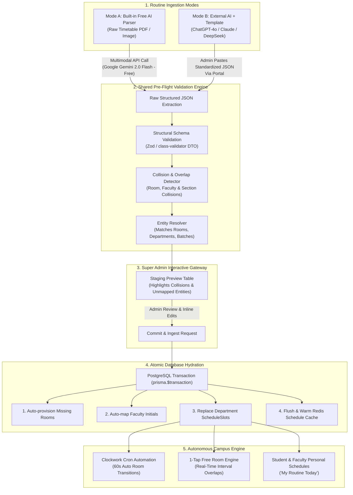

# 📋 Timetable Conversion & Routine Ingestion Engine (`convert_routine.md`)
> **UniRoom-Live 2.0 — Routine Conversion, AI Parsing & Autonomous Ingestion Pipeline**  
> *Target Audience: System Architects, Backend Engineers & Technical Defense*  
> *Location: `project docs/convert_routine.md`*

---

## 📌 1. Problem Statement: The University Timetable Nightmare

Universities generate 5- to 15-page complex master timetable PDFs using specialized scheduling software (e.g., `aSc Timetables`). These documents feature:
- Dense grid structures with multi-span merged cells.
- Hundreds of sections (e.g., CSE Batch 64 to 71, Sections A, B, C, D).
- Shortened room names (e.g., `AI Lab 5210 (514)`, `5030 (508)`).
- Faculty initials (e.g., `DNS`, `AMU`, `RIR`, `FAC-102`).
- Complex timeslots (e.g., `08:30-09:50`, `11:25-12:45`, `02:05-03:25`).

### Why Manual Entry Fails:
A single department routine contains **350–500 unique weekly class slots**. Manually entering these slots via standard web forms takes **18–25 human hours per semester** and suffers an estimated **8–12% human data entry error rate** (incorrect room numbers, flipped AM/PM, missed sections).

### The Solution: Dual-Mode Automated Conversion
UniRoom-Live 2.0 introduces an automated routine conversion pipeline that ingests raw routine documents (PDF, Image, or JSON), validates them against strict mathematical collision rules, presents an interactive staging gateway to the Super Admin, and hydrates the database in a single atomic transaction ($< 2.0\text{ seconds}$).

---

## 🏗️ 2. Dual-Mode Conversion Pipeline Architecture



---

## 📑 3. Standardized Routine Data Contract (Target Schema)

Regardless of whether the input is parsed via Gemini Flash (Mode A) or an external LLM (Mode B), the pipeline normalizes the routine into the following strict JSON schema:

```json
{
  "university": "UU",
  "department": "CSE",
  "semester": "Fall 2026",
  "slots": [
    {
      "dayOfWeek": "SUN",
      "startTime": "08:30",
      "endTime": "09:50",
      "roomNumber": "5030 (508)",
      "buildingName": "Building B",
      "campusName": "Permanent Campus",
      "courseCode": "CSE06131",
      "courseName": "Algorithms",
      "batch": "68",
      "section": "A",
      "facultyCode": "DNS"
    },
    {
      "dayOfWeek": "SUN",
      "startTime": "09:55",
      "endTime": "11:15",
      "roomNumber": "AI Lab 5210 (514)",
      "buildingName": "Building B",
      "campusName": "Permanent Campus",
      "courseCode": "CSE06132",
      "courseName": "Algorithms Lab",
      "batch": "68",
      "section": "A",
      "facultyCode": "DNS"
    }
  ]
}
```

### TypeScript Data Transfer Object (DTO)
```typescript
import { DayOfWeek } from '@prisma/client';
import { IsEnum, IsNotEmpty, IsOptional, IsString, Matches, ValidateNested } from 'class-validator';
import { Type } from 'class-transformer';

export class RoutineSlotDto {
  @IsEnum(DayOfWeek, { message: 'dayOfWeek must be SUN, MON, TUE, WED, THU, FRI, or SAT' })
  dayOfWeek!: DayOfWeek;

  @Matches(/^([01]\d|2[0-3]):([0-5]\d)$/, { message: 'startTime must be 24-hr format HH:mm' })
  startTime!: string;

  @Matches(/^([01]\d|2[0-3]):([0-5]\d)$/, { message: 'endTime must be 24-hr format HH:mm' })
  endTime!: string;

  @IsString()
  @IsNotEmpty({ message: 'roomNumber is required' })
  roomNumber!: string;

  @IsOptional()
  @IsString()
  buildingName?: string;

  @IsString()
  @IsNotEmpty()
  courseCode!: string;

  @IsString()
  @IsNotEmpty()
  courseName!: string;

  @IsString()
  @IsNotEmpty()
  batch!: string;

  @IsString()
  @IsNotEmpty()
  section!: string;

  @IsString()
  @IsNotEmpty()
  facultyCode!: string;
}

export class IngestRoutineDto {
  @IsString()
  @IsNotEmpty()
  university!: string;

  @IsString()
  @IsNotEmpty()
  department!: string;

  @IsOptional()
  @IsString()
  semester?: string;

  @ValidateNested({ each: true })
  @Type(() => RoutineSlotDto)
  slots!: RoutineSlotDto[];
}
```

---

## 🤖 4. Dual-Mode Ingestion Deep Dive

### Mode A: Built-in Free AI Parser (Google Gemini 2.0 Flash)
* **API Cost**: $0 (Google AI Studio Free Tier allows 15 RPM and 1,500 requests/day).
* **Workflow**:
  1. Super Admin uploads PDF in Admin Portal (`/schedules/upload`).
  2. Backend converts the PDF pages into base64 image/document chunks.
  3. Sends request to Gemini 2.0 Flash with `response_mime_type: "application/json"` and strict JSON schema enforcement.
  4. Returns validated JSON payload directly to the staging gateway.

#### Gemini System Prompt:
```text
You are an expert university timetable extractor. Convert the uploaded university routine document into a JSON array of class schedule slots.
Format requirements:
- dayOfWeek: Must be uppercase 3-letter abbreviation (SUN, MON, TUE, WED, THU, FRI, SAT).
- startTime and endTime: Must be 24-hour format HH:mm (e.g., 08:30, 11:25, 14:05).
- roomNumber: Standardize room numbers (e.g., "5030 (508)", "AI Lab 5210").
- batch: Extract batch number (e.g., "68").
- section: Extract section letter (e.g., "A", "B").
- facultyCode: Extract teacher initials (e.g., "DNS", "AMU").
Do not include conversational text or markdown code fences; return strictly raw valid JSON matching the schema.
```

---

### Mode B: External AI Prompt Template (Graceful Degradation)
If university networks restrict Gemini or quota limits are exceeded, Super Admin clicks **"Copy Master AI Prompt"** in the Admin Portal and pastes their PDF directly into ChatGPT-4o, Claude 3.5 Sonnet, or DeepSeek.

#### Standardized External Copy Prompt:
````markdown
Please extract all schedule slots from this timetable PDF and return ONLY a raw JSON document following this exact structure without markdown backticks:

{
  "university": "UU",
  "department": "CSE",
  "slots": [
    {
      "dayOfWeek": "SUN",
      "startTime": "08:30",
      "endTime": "09:50",
      "roomNumber": "5030",
      "courseCode": "CSE06131",
      "courseName": "Algorithms",
      "batch": "68",
      "section": "A",
      "facultyCode": "DNS"
    }
  ]
}

Rules:
1. All times must be in 24-hour format HH:mm.
2. dayOfWeek must be one of: SUN, MON, TUE, WED, THU, FRI, SAT.
3. Clean room numbers and strip extraneous labels.
````

Admin pastes the generated JSON into the Admin Portal JSON tab and clicks **"Validate & Preview"**.

---

## 🛡️ 5. Pre-Flight Validation & Mathematical Collision Engine

Before any database write occurs, the parsed slots are analyzed in-memory to detect academic timetable collisions:

### 1. Room Double-Booking Collision
No physical room can host two different classes simultaneously on the same weekday:

$$\text{Collision}_{\text{Room}} \iff \text{Room}_A = \text{Room}_B \land \text{Day}_A = \text{Day}_B \land \left( S_A < E_B \land E_A > S_B \right)$$

### 2. Faculty Overlapping Collision
A single faculty member cannot be scheduled to teach in two different rooms at the same time:

$$\text{Collision}_{\text{Faculty}} \iff \text{Faculty}_A = \text{Faculty}_B \land \text{Day}_A = \text{Day}_B \land \left( S_A < E_B \land E_A > S_B \right)$$

### 3. Student Batch/Section Collision
A specific student cohort (e.g. `Batch 68, Section A`) cannot have two concurrent lectures:

$$\text{Collision}_{\text{Section}} \iff \text{Batch}_A = \text{Batch}_B \land \text{Sec}_A = \text{Sec}_B \land \text{Day}_A = \text{Day}_B \land \left( S_A < E_B \land E_A > S_B \right)$$

### Pre-Flight Diagnostic Response:
```json
{
  "isValid": false,
  "totalSlots": 412,
  "collisions": [
    {
      "type": "ROOM_DOUBLE_BOOKED",
      "severity": "CRITICAL",
      "room": "5030 (508)",
      "day": "SUN",
      "timeWindow": "08:30 - 09:50",
      "conflictingSlots": [
        { "batch": "68", "section": "A", "course": "Algorithms", "faculty": "DNS" },
        { "batch": "69", "section": "B", "course": "Database", "faculty": "AMU" }
      ],
      "message": "Room '5030 (508)' is double-booked on SUN between 08:30 and 09:50."
    }
  ],
  "unmappedEntities": {
    "missingRooms": ["New Physics Lab 7010"],
    "newFacultyCodes": ["KAZ", "MHR"]
  }
}
```

The Super Admin can fix the collision directly in the staging preview grid before committing.

---

## ⚡ 6. Atomic Database Hydration (`prisma.$transaction`)

Once validated, the entire routine is committed inside a **single atomic PostgreSQL transaction**:

```typescript
async ingestRoutine(dto: IngestRoutineDto): Promise<IngestResult> {
  const { university, department, slots } = dto;

  return this.prisma.$transaction(async (tx) => {
    // 1. Resolve Target Department & University
    const targetDept = await this.resolveDepartment(tx, university, department);

    // 2. Auto-Provision Missing Rooms
    const uniqueRoomNumbers = [...new Set(slots.map(s => s.roomNumber.trim()))];
    const defaultBuilding = await this.resolveOrCreateDefaultBuilding(tx, targetDept.id);

    const roomMap = new Map<string, string>(); // roomNumber -> roomId
    for (const rNum of uniqueRoomNumbers) {
      const room = await tx.room.upsert({
        where: {
          buildingId_roomNumber: {
            buildingId: defaultBuilding.id,
            roomNumber: rNum,
          },
        },
        create: {
          universityId: targetDept.universityId,
          departmentId: targetDept.id,
          buildingId: defaultBuilding.id,
          roomNumber: rNum,
          floor: this.inferFloorFromRoom(rNum),
          capacity: 45,
          currentStatus: RoomStatus.AVAILABLE,
          version: 1,
        },
        update: {},
      });
      roomMap.set(rNum, room.id);
    }

    // 3. Clear Existing Master Schedule Slots for this Department (Atomic Replacement)
    await tx.scheduleSlot.deleteMany({
      where: { departmentId: targetDept.id },
    });

    // 4. Bulk Insert All Normalized Schedule Slots
    const slotData = slots.map(s => ({
      departmentId: targetDept.id,
      roomId: roomMap.get(s.roomNumber.trim())!,
      facultyInitials: s.facultyCode.trim().toUpperCase(),
      batch: s.batch.trim(),
      section: s.section.trim().toUpperCase(),
      courseCode: s.courseCode.trim().toUpperCase(),
      courseName: s.courseName.trim(),
      dayOfWeek: s.dayOfWeek,
      startTime: s.startTime.trim(),
      endTime: s.endTime.trim(),
      isActive: true,
    }));

    const result = await tx.scheduleSlot.createMany({
      data: slotData,
    });

    // 5. Invalidate Redis Caches
    await this.redisService.del(`cache:schedules:${targetDept.id}`);
    await this.redisService.del(`cache:rooms:${targetDept.id}`);

    return {
      success: true,
      department: targetDept.code,
      slotsCreated: result.count,
      roomsProvisioned: uniqueRoomNumbers.length,
    };
  });
}
```

---

## ⏱️ 7. Downstream Automation: How the Routine Powers the Campus

Once the routine is committed into `schedule_slots`, the autonomous systems immediately activate:

| System Feature | How Routine Data Drives It |
| :--- | :--- |
| **Clockwork Cron Engine** | Runs every 60s. When live clock matches `startTime` on `dayOfWeek`, room flips to `RUNNING_CLASS` and sets `currentCourse`, `currentTeacher`, `currentBatch`. When clock hits `endTime`, room auto-releases to `AVAILABLE`. |
| **1-Tap "Find Free Room Now"** | Calculates mathematical intervals: $\text{slot.startTime} < \text{reqEnd} \land \text{slot.endTime} > \text{reqStart}$. Instantly identifies vacant gaps between scheduled lectures. |
| **Daily CR/Faculty Overrides** | When class is cancelled, `ScheduleOverride` suppresses the scheduled slot; the room remains free for ad-hoc study sessions. |
| **Faculty Routine Aggregation** | Indexes `idx_schedules_faculty_lookup`. When a teacher logs into the mobile app, their 5 disparate batch schedules are aggregated into a unified weekly calendar. |
| **Student "My Routine Today"** | Queries `departmentId`, `batch`, and `section` with $O(1)$ composite index speed. Students see their exact daily classroom path. |

---

## 🏫 8. Production Case Study: Uttara University CSE Department (Fall 2026 Routine)

The following is an exact technical analysis of the official 5-page timetable document:
* **Institution**: Uttara University (`UU`)
* **Department**: Department of Computer Science & Engineering (`CSE`)
* **Semester**: Fall 2026
* **Document Source**: `aSc Timetables` Summary Timetable of Classes (`MO2000HA`)
* **Reference Dataset**: [`project docs/cse_fall_2026_routine.json`](file:///e:/Varsity%20Project/UniRoom-Live/project%20docs/cse_fall_2026_routine.json)

### A. Academic Operating Days & Timeslot Grid
The university operates on a 4-day undergraduate class cycle (Monday to Thursday):

| Period | Time Window | Duration | Slot Nature |
| :---: | :---: | :---: | :--- |
| **Period 1** | `08:45` – `10:05` | 80 min | Theory Lecture / Morning Lab Block 1 |
| **Period 2** | `10:05` – `11:25` | 80 min | Theory Lecture / Morning Lab Block 2 |
| **Period 3** | `11:25` – `12:45` | 80 min | Theory Lecture / Midday Slot |
| *Break* | `12:45` – `13:15` | 30 min | Campus Prayer & Lunch Interval |
| **Period 4** | `13:15` – `14:35` | 80 min | Afternoon Lecture / Afternoon Lab Block 1 |
| **Period 5** | `14:35` – `15:55` | 80 min | Afternoon Lecture / Afternoon Lab Block 2 |
| **Period 6** | `15:55` – `17:15` | 80 min | Late Afternoon Slot |

### B. Multi-Period Laboratory Normalization Rule
In the PDF, laboratory classes (e.g. `CSE0613102`, `PHY0533102`, `ENG0232102`) span two consecutive periods without a break:
- **Morning Lab Span (Periods 1 & 2)**: Normalized to `startTime: "08:45"`, `endTime: "11:25"` (160 minutes continuous).
- **Afternoon Lab Span (Periods 4 & 5)**: Normalized to `startTime: "13:15"`, `endTime: "15:55"` (160 minutes continuous).

This preserves single-session room occupancy leases and prevents the auto-release cron from prematurely marking the laboratory as available halfway through an ongoing experiment.

### C. Discovered Physical Room Catalog
From this 5-page document, the parser extracts **32 distinct physical facilities** across Building B (Permanent Campus):

| Facility Type | Room Number / Name | Typical Capacity | Inferred Floor |
| :--- | :--- | :---: | :---: |
| **Specialized Lab** | `AI Lab 5210 (514)` | 45 | Floor 5 |
| **Specialized Lab** | `Phy Lab 6080 (601)` | 40 | Floor 6 |
| **Specialized Lab** | `Electronic Lab 3200 (315)` | 35 | Floor 3 |
| **Specialized Lab** | `Electric Lab 3210 (316)` | 35 | Floor 3 |
| **Specialized Lab** | `DLD Lab 0018 (B104)` | 40 | Basement / Gr. |
| **Computing Lab** | `Lab 5160 (509)`, `Lab 5180 (511)`, `Lab 5200 (513)`, `Lab 5220 (515)` | 45 | Floor 5 |
| **Computing Lab** | `Lab 6150 (612)`, `Lab 6180 (613)` | 45 | Floor 6 |
| **Lecture Hall** | `5030 (508)`, `5060 (503)`, `5070 (502)`, `5080 (501)`, `5190 (512)`, `5230 (516)` | 55 | Floor 5 |
| **Lecture Hall** | `6020 (607)`, `6030 (608)`, `6170 (614)` | 50 | Floor 6 |
| **Lecture Hall** | `4020 (407)` | 60 | Floor 4 |
| **Lecture Hall** | `3170 (312)`, `3180 (313)` | 50 | Floor 3 |
| **Basement / Annex** | `0005`, `0006`, `0017 (B103)`, `0020 (B106/1)`, `0022 (B106/2)`, `0023 ((B108)`, `0024 (B109)`, `A004` | 40 | Basement |

### D. Cohort Registry (10 Batches, 48 Sections)
* **Page 1**: Batch 68 (A–E), Batch 67 (A–F)
* **Page 2**: Batch 67 (G), Batch 66 (A–D), Batch 65 (A–D), Batch 64 (A–B)
* **Page 3**: Batch 64 (C–E), Batch 63 (A–C), Batch 62 (A–D), Batch 61 (A)
* **Page 4**: Batch 61 (B–F), Batch 60 (A–F)
* **Page 5**: Batch 60 (G–H), Batch 59 (A–B)

---

# 🇧🇩 বাংলা সংস্করণ: রুটিন কনভার্সন ইঞ্জিনের সহজ গাইড

### ১. মূল সমস্যা
বিশ্ববিদ্যালয়গুলো যখন ৫-১০ পৃষ্ঠার বিশাল PDF রুটিন দেয়, তখন তাতে শত শত সেকশন, শিক্ষক কোড এবং রুম এলোমেলোভাবে সাজানো থাকে। কোনো মানুষের পক্ষে ৪০০+ ক্লাসের তথ্য একটা একটা করে টাইপ করে সিস্টেমে দেওয়া অসম্ভব এবং এতে প্রচুর ভুল হয়।

### ২. ডুয়াল-মোড কনভার্সন সিস্টেম
UniRoom-Live ২.০ সিস্টেমে রুটিন আপলোডের জন্য দুটি অপশন রয়েছে:
* **মোড A (ফ্রি ইন-বিল্ট AI পার্সার)**: সুপার অ্যাডমিন সরাসরি PDF বা ছবি আপলোড করবেন। গুগল জেমিনাই ফ্ল্যাশ (সম্পূর্ণ ফ্রি টায়ার) স্বয়ংক্রিয়ভাবে পুরো ডকুমেন্ট পড়ে সেকেন্ডের মধ্যে ক্লিন JSON তৈরি করে দেবে।
* **মোড B (এক্সটার্নাল AI ও টেমপ্লেট)**: কোনো কারণে সরাসরি AI কাজ না করলে অ্যাডমিন ১-ক্লিকে "Copy AI Prompt" চাপবেন এবং ChatGPT বা Claude এ রুটিনটি পেস্ট করে তৈরি হওয়া JSON অ্যাডমিন প্যানেলে পেস্ট করবেন।

### ৩. কনফ্লিক্ট ও ডাবল-বুকিং ডিটেকশন
ডাটাবেসে সেভ করার আগে সিস্টেম স্বয়ংক্রিয়ভাবে অংক কষে পরীক্ষা করে:
1. **একই রুমে একই সময়ে দুটি ক্লাস দেওয়া হয়েছে কি না?**
2. **একই শিক্ষক একই সময়ে দুটি ভিন্ন রুমে শিডিউল হয়েছেন কি না?**
3. **একই ব্যাচ ও সেকশনের একই সময়ে দুটি ক্লাস পড়ে গেছে কি না?**

কোনো ভুল থাকলে সিস্টেম তা লাল দাগ দিয়ে অ্যাডমিনকে দেখিয়ে দেয় এবং অ্যাডমিন স্ক্রিনেই তা ঠিক করে নিতে পারেন।

### ৪. ডাটাবেসে সেভ ও লাইভ অটোমেশন
সঠিকভাবে ভ্যালিডেট হওয়ার পর একটি সিঙ্গেল ট্রানজ্যাকশনে ($< ২.০$ সেকেন্ডে) পুরো ডিপার্টমেন্টের সব রুম ও ৪০০+ ক্লাস স্লট ডাটাবেসে যুক্ত হয়ে যায়। এর সাথে সাথেই:
* প্রতি ৬০ সেকেন্ডের ব্যাকএন্ড ক্রন চালু হয়ে যায় (ক্লাসের সময়ে রুম লাল/অকুপাইড, ক্লাস শেষে সবুজ/ফ্রি)।
* স্টুডেন্টদের "Find Me a Free Room Now" বাটনে ফাঁকা রুমগুলো লাইভ দেখা শুরু করে।
* শিক্ষক ও শিক্ষার্থীদের মোবাইল অ্যাপে আজকের সম্পূর্ণ ক্লাসের রুটিন স্বয়ংক্রিয়ভাবে চলে আসে।
