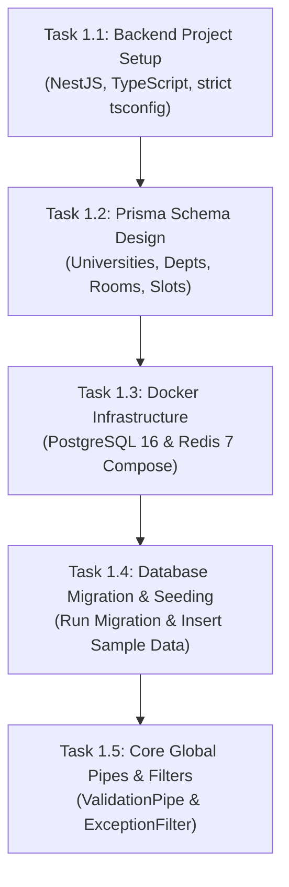

# Milestone 1: Backend Core, Docker Infrastructure & Prisma Multi-Tenant Schema 🚀🐘

> **Location**: `docs/milestone_one.md`  
> **Milestone Goal**: Establish the foundational backend architecture, multi-tenant relational database schema, containerized database infrastructure, and global error handling pipeline.  
> **Status**: Ready for Execution

---

## ১. মাইলস্টোন ১ এর উদ্দেশ্য ও সারসংক্ষেপ (Objective & Summary)

যে কোনো সফটওয়্যার সিস্টেমে বিজনেস লজিক বা ক্লায়েন্ট অ্যাপ তৈরির আগে একটি **দৃঢ় ডাটাবেজ ভিত্তি (Data Foundation)** এবং **সার্ভার ফ্রেমওয়ার্ক** থাকা আবশ্যক। 

এই মাইলস্টোনে আমরা:
1. `backend/` ডিরেক্টরি তৈরি করে **NestJS + TypeScript** মডুলার মনোলিথ আর্কিটেকচার সেটআপ করব।
2. **Prisma ORM** দিয়ে আমাদের মাল্টি-টেন্যান্ট ডাটাবেজ স্কিমা (`Universities`, `Departments`, `Rooms`, `Users`, `ScheduleSlots`, `ScheduleOverrides`) মডেল করব।
3. **Docker Compose** দিয়ে লোকাল পিসিতে **PostgreSQL 16** এবং **Redis 7** এর কনটেইনার চালু করব।
4. ডাটাবেজে প্রথম মাইগ্রেশন চালিয়ে স্যাম্পল সিড ডাটা (উত্তরা ইউনিভার্সিটি ও সিএসই ডিপার্টমেন্ট) ইনসার্ট করব।
5. এন্টারপ্রাইজ গ্লোবাল ভ্যালিডেশন পাইপ ও এক্সেপশন ফিল্টার বসাব, যাতে কোনো ভুল ডাটা সার্ভারে ঢুকতে না পারে।

---

## ২. সেটআপের জন্য মেশিনে যা যা প্রয়োজন (Prerequisites & Tools Required)

এই মাইলস্টোনটি রান করার জন্য আপনার লোকাল উইন্ডোজ মেশিনে নিচের টুলগুলো থাকতে হবে:

| টুল (Tool) | প্রয়োজনীয় ভার্সন | কেন দরকার? (Purpose) |
| :--- | :--- | :--- |
| **Node.js** | v18.x বা v20.x+ (LTS) | ব্যাকএন্ডের জাভাস্ক্রিপ্ট/টাইপস্ক্রিপ্ট রানটাইম ইঞ্জিন। |
| **npm** | v9.x বা v10.x+ | নোড প্যাকেজ ম্যানেজার (ডিপেন্ডেন্সি ইন্সটলেশন)। |
| **Docker Desktop** | Latest Stable | আপনার উইন্ডোজে কোনো সফটওয়্যার ইন্সটল ছাড়াই আইসোলেটেড PostgreSQL ও Redis কন্টেইনার রান করার জন্য। |
| **Git** | Latest | কোড ভার্সন কন্ট্রোল ও ট্র্যাকিং। |
| **VS Code / IDE** | Latest | কোড এডিটর (Prisma ও NestJS এক্সটেনশন সহ)। |

---

## ৩. যেসব প্যাকেজ ও লাইব্রেরি ইন্সটল করা হবে (Dependencies Breakdown)

আমরা কোনো অপ্রয়োজনীয় প্যাকেজ ইন্সটল করব না। প্রতিটি প্যাকেজের একটি সুনির্দিষ্ট সফটওয়্যার ইঞ্জিনিয়ারিং কারণ রয়েছে:

```
┌────────────────────────────────────────────────────────────────────────────────────────┐
│                               BACKEND DEPENDENCY STACK                                 │
├──────────────────────────┬───────────────────────┬─────────────────────────────────────┤
│ প্যাকেজ নাম (Package)    │ ধরন (Category)        │ কেন ব্যবহার করছি? (The "Why")       │
├──────────────────────────┼───────────────────────┼─────────────────────────────────────┤
│ @nestjs/core & common    │ Core Framework        │ মডুলার আর্কিটেকচার ও ডিপেন্ডেন্সি   │
│                          │                       │ ইনজেকশন কন্ট্রোলার হ্যান্ডলিং।       │
├──────────────────────────┼───────────────────────┼─────────────────────────────────────┤
│ @nestjs/platform-express │ HTTP Server           │ ফাস্ট HTTP রিকোয়েস্ট/রেসপন্স হ্যান্ডলার।│
├──────────────────────────┼───────────────────────┼─────────────────────────────────────┤
│ prisma & @prisma/client  │ Next-Gen ORM          │ ১০০% টাইপ-সেফ ডাটাবেজ কুয়েরি ও      │
│                          │                       │ স্বয়ংক্রিয় স্কিমা মাইগ্রেশন।        │
├──────────────────────────┼───────────────────────┼─────────────────────────────────────┤
│ class-validator          │ Input Validation      │ DTO এর মাধ্যমে রিকোয়েস্ট বডি        │
│ class-transformer        │                       │ স্বয়ংক্রিয়ভাবে ভ্যালিডেট করা।        │
├──────────────────────────┼───────────────────────┼─────────────────────────────────────┤
│ @nestjs/config           │ Environment Config    │ টাইপ-সেফ `.env` ভেরিয়েবল লোডার।     │
├──────────────────────────┼───────────────────────┼─────────────────────────────────────┤
│ reflect-metadata & rxjs  │ NestJS Peerdeps       │ ডেকোরেটর ও রিঅ্যাক্টিভ ইভেন্ট হ্যান্ডলিং।│
└──────────────────────────┴───────────────────────┴─────────────────────────────────────┘
```

---

## ৪. ধাপে ধাপে ৫টি টাস্কের বিস্তারিত বিবরণ (Step-by-Step Tasks)



### 🔹 Task 1.1: Backend Project Initialization & Monorepo Structure
- **লক্ষ্য:** রুট ফোল্ডারে `backend/` তৈরি করা।
- **কী কোড লেখা হবে:**
  - `backend/package.json`: প্রজেক্ট মেটাডাটা ও ডিপেন্ডেন্সি ডিফিনিশন।
  - `backend/tsconfig.json`: স্ট্রিক্ট টাইপ চেকিং (`"strict": true`, `"noImplicitAny": true`)।
  - `backend/src/main.ts`: সার্ভার বুটস্ট্র্যাপ ফাইল (Port 3000)।
  - `backend/src/app.module.ts`: রুট মডিউল।
- **ভেরিফিকেশন:** `npm run build` চালালে কোনো এরর ছাড়া `dist/` ফোল্ডারে জাভাস্ক্রিপ্ট কম্পাইল হবে।

### 🔹 Task 1.2: Multi-Tenant Prisma Schema Design
- **লক্ষ্য:** `backend/prisma/schema.prisma` ফাইলে আমাদের চূড়ান্ত রিলেশনাল মডেল তৈরি করা।
- **টেবিলসমূহ:**
  1. `University`: মাল্টি-টেন্যান্ট রুট।
  2. `Department`: বিশ্ববিদ্যালয়ের অধীনস্থ ডিপার্টমেন্ট (যেমন: CSE)।
  3. `Building`: মাল্টি-ক্যাম্পাস ও ভবন সনাক্তকরণ।
  4. `Room`: ক্লাসরুম/ল্যাব (ক্যাপাসিটি, স্ট্যাটাস, `version` কলাম ফর OCC)।
  5. `User`: ৪টি রোল (`STUDENT`, `CR`, `FACULTY`, `SUPER_ADMIN`)।
  6. `ScheduleSlot`: সেকশন ও ব্যাচ ভিত্তিক সাপ্তাহিক রুটিন স্লট।
  7. `ScheduleOverride`: দৈনিক মেক-আপ ক্লাস ও রুম শিফট।
  8. `RoomLog`: অডিট হিস্ট্রি।
- **ভেরিফিকেশন:** `npx prisma validate` কমান্ড স্কিমা ভ্যালিড বলে আউটপুট দেবে।

### 🔹 Task 1.3: Docker Infrastructure Boot & Healthchecks
- **লক্ষ্য:** রুটে `docker-compose.yml` ফাইল তৈরি করে ডাটাবেজ কন্টেইনার চালু করা।
- **সার্ভিসসমূহ:**
  - `uniroom-db`: PostgreSQL 16 (Port 5432)।
  - `uniroom-redis`: Redis 7 (Port 6379)।
- **ভেরিফিকেশন:** `docker compose up -d` দিলে ডকার ড্যাশবোর্ডে উভয় কন্টেইনার **Healthy (Green)** দেখাবে।

### 🔹 Task 1.4: Initial Database Migration & Seeding
- **লক্ষ্য:** প্রিজমা স্কিমাকে বাস্তব পোস্টগ্রেস ডাটাবেজের টেবিলে রূপান্তর করা এবং পরীক্ষামূলক ডাটা ইনসার্ট করা।
- **কী কমান্ড চলবে:**
  - `npx prisma migrate dev --name init_multitenant_schema`
  - `npx prisma db seed` (উত্তরা ইউনিভার্সিটি ও সিএসই ডিপার্টমেন্টের কয়েকটি রুম ইনসার্ট করবে)।
- **ভেরিফিকেশন:** `npx prisma studio` রান করলে ব্রাউজারে সুন্দর গ্রাফিক্যাল টেবিলে ডাটা দেখা যাবে।

### 🔹 Task 1.5: Core Cross-Cutting Infrastructure (Global Filters & Pipes)
- **লক্ষ্য:** সেন্ট্রালাইজড এরর হ্যান্ডলার এবং ডাটা ভ্যালিডেটর যুক্ত করা।
- **কী কোড লেখা হবে:**
  - `ValidationPipe`: ক্লায়েন্ট থেকে আসা DTO ফিল্ডগুলো স্বয়ংক্রিয়ভাবে টাইপ ও ফরম্যাট যাচাই করবে।
  - `HttpExceptionFilter`: সব এরর রেসপন্স একটি স্ট্যান্ডার্ড ফরম্যাটে কনভার্ট করবে:
    ```json
    {
      "success": false,
      "statusCode": 400,
      "message": "Validation failed: email must be a valid email",
      "timestamp": "2026-09-16T10:30:00Z"
    }
    ```
- **ভেরিফিকেশন:** ভুল পে-লোড দিয়ে এপিআই টেস্ট করলে সুন্দর এরর মেসেজ আসবে।

---

## ৫. মাইলস্টোন ১ এর ফাইল স্ট্রাকচার ওভারভিউ

এই মাইলস্টোন শেষে আমাদের `backend/` ফোল্ডারটি দেখতে নিচের মতো পরিচ্ছন্ন হবে:

```
UniRoom-Live/
├── backend/
│   ├── prisma/
│   │   ├── migrations/          # অটোমেটিক এসকিউএল মাইগ্রেশন হিস্ট্রি
│   │   ├── schema.prisma        # মূল রিলেশনাল ডাটাবেজ স্কিমা
│   │   └── seed.ts              # স্যাম্পল ইউনিভার্সিটি ও রুম ডাটা সিডার
│   ├── src/
│   │   ├── common/
│   │   │   ├── filters/         # Global HttpExceptionFilter
│   │   │   └── pipes/           # Global ValidationPipe
│   │   ├── app.module.ts        # রুট মডিউল
│   │   └── main.ts              # সার্ভার এন্ট্রি পয়েন্ট
│   ├── .env                     # ডাটাবেজ ও রেডিস কানেকশন স্ট্রিং
│   ├── package.json             # ডিপেন্ডেন্সি তালিকা
│   └── tsconfig.json            # স্ট্রিক্ট টাইপস্ক্রিপ্ট কনফিগ
│
├── docker-compose.yml           # PostgreSQL ও Redis কন্টেইনার কনফিগারেশন
├── docs/                        # আর্কিটেকচার ও মাইলস্টোন ডকুমেন্টস
└── tasks.md                     # টাস্ক ট্র্যাকার
```

---

## ৬. মাইলস্টোন ১ শেষ করার পর আপনি কী শিখবেন এবং ব্যাখ্যা করতে পারবেন?

1. **মাল্টি-টেন্যান্ট রিলেশনাল ডাটাবেজ আর্কিটেকচার**: কীভাবে `university_id` এবং `department_id` দিয়ে শত শত শিক্ষা প্রতিষ্ঠানকে একটি ডাটাবেজেই নিরাপদে আলাদা রাখা যায়।
2. **Optimistic Concurrency Control (OCC)**: কেন রুমে `version` কলাম রাখা হয়েছে এবং কীভাবে এটি ডাবল-বুকিং প্রতিরোধ করে।
3. **Infrastructure as Code (Docker Compose)**: কীভাবে উইন্ডোজে কোনো ডাটাবেজ ইন্সটল ছাড়াই ডকার কন্টেইনার দিয়ে প্রফেশনাল ডেভলপমেন্ট রান করা যায়।
4. **Prisma Schema Migrations**: প্রোডাকশন সফটওয়্যারে কোনো ডাটা না হারিয়ে ডাটাবেজ স্কিমা ভার্সনিং করার নিয়ম।
