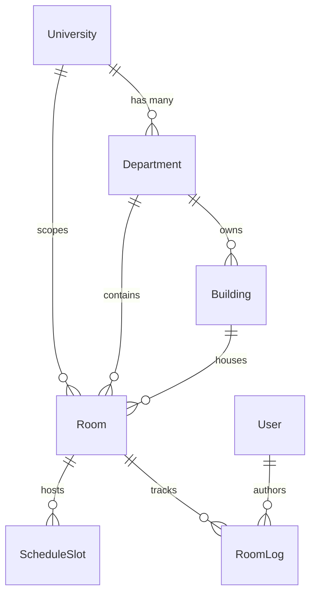

# 🚪 Milestone 3: Campus Hierarchy, Room Inventory & Availability Engine
> **UniRoom-Live 2.0 — Milestone 3 Technical Specifications & Architecture Document**  
> *Target Audience: Engineering Team & Technical Defense*  
> *Location: `project docs/milestone_three.md`*

---

## 📌 1. Milestone Overview & Objectives
Milestone 3 implements the physical campus hierarchy, room catalog, real-time availability query engine, and the 1-Tap "Find Me a Free Room Now" algorithm.

### Core Objectives:
1. **Institutional Physical Hierarchy**: Super Admin management of `University`, `Department`, and `Building` with campus attribution.
2. **Room Catalog & Compound Uniqueness**: Physical room entity modeling with `[buildingId, roomNumber]` uniqueness constraint.
3. **High-Performance Room Query Engine**: Indexed querying by department, building, campus, floor, and live status with pagination and status metrics.
4. **1-Tap "Find Me a Free Room Now" Algorithm**: Algorithmic engine that evaluates the current day of the week, live clock time, overlapping timetable `ScheduleSlot` intervals, and active `ScheduleOverride` modifications to return ranked available rooms.
5. **Optimistic Concurrency Control (OCC)**: Version-based locking (`version` column) on room state changes to prevent double-booking collisions under high concurrent load, audited via `RoomLog`.

---

## 🏢 2. Relational Campus Model



---

## ⚡ 3. The 1-Tap Free Room Algorithm

### Interval Overlap Formula
To test if a scheduled class slot $[S_{\text{start}}, S_{\text{end}}]$ overlaps with a user's requested reservation window $[R_{\text{start}}, R_{\text{end}}]$:

$$\text{Overlap} \iff S_{\text{start}} < R_{\text{end}} \land S_{\text{end}} > R_{\text{start}}$$

### Override Handling:
- If a slot overlaps but has an active `ScheduleOverride` with `action == CANCELLED` for today's date, the class is cancelled $\implies$ the room is **freed**.
- If a slot has `action == ROOM_SHIFTED` and `newRoomId == room.id`, another class was shifted into this room $\implies$ the room is **occupied**.

---

## 🔒 4. Optimistic Concurrency Control (OCC)

When a CR or Faculty member updates a room status (`PATCH /api/v1/rooms/:id/status`):
1. The client must submit the current `version` integer (e.g. `version: 1`).
2. The server executes:
   ```sql
   UPDATE rooms 
   SET currentStatus = :newStatus, version = version + 1, leaseExpiresAt = :leaseExpiresAt
   WHERE id = :id AND version = :expectedVersion;
   ```
3. If another CR updated the room 2 milliseconds earlier, `room.version` is already `2`. The query matches 0 rows.
4. The server intercepts this and throws an `HTTP 409 ConflictException`, preventing double-booking without blocking table locks.

---

## 📡 5. API Endpoints Table

| Method | Endpoint | Access Role | Description |
| :--- | :--- | :--- | :--- |
| `GET` | `/api/v1/universities` | Public | List active universities |
| `GET` | `/api/v1/universities/:id` | Public | University details with departments |
| `POST` | `/api/v1/admin/universities` | `SUPER_ADMIN` | Create a new university |
| `PUT` | `/api/v1/admin/universities/:id` | `SUPER_ADMIN` | Update university |
| `DELETE` | `/api/v1/admin/universities/:id` | `SUPER_ADMIN` | Delete university (cascades) |
| `GET` | `/api/v1/universities/:universityId/departments` | Public | List university departments |
| `POST` | `/api/v1/admin/departments` | `SUPER_ADMIN` | Create academic department |
| `PUT` | `/api/v1/admin/departments/:id` | `SUPER_ADMIN` | Update academic department |
| `DELETE` | `/api/v1/admin/departments/:id` | `SUPER_ADMIN` | Delete department (cascades) |
| `GET` | `/api/v1/buildings` | Public | List campus buildings |
| `GET` | `/api/v1/buildings/:id` | Public | Building details and rooms |
| `POST` | `/api/v1/admin/buildings` | `SUPER_ADMIN` | Create a campus building |
| `PUT` | `/api/v1/admin/buildings/:id` | `SUPER_ADMIN` | Update campus building |
| `DELETE` | `/api/v1/admin/buildings/:id` | `SUPER_ADMIN` | Delete campus building |
| `GET` | `/api/v1/rooms` | Public / Scoped | Query rooms with filters, pagination, and status stats |
| `GET` | `/api/v1/rooms/:id` | Public | Room details with schedule and recent logs |
| `GET` | `/api/v1/rooms/free-now` | Authenticated | **1-Tap "Find Me a Free Room Now" Algorithm** |
| `PATCH` | `/api/v1/rooms/:id/status` | `SUPER_ADMIN`, `FACULTY`, `CR` | Update room status with OCC version locking |
| `GET` | `/api/v1/rooms/:id/logs` | Authenticated | Room status audit trail (`RoomLog`) |
| `POST` | `/api/v1/admin/rooms` | `SUPER_ADMIN` | Create a new physical room |
| `PUT` | `/api/v1/admin/rooms/:id` | `SUPER_ADMIN` | Update physical room details |
| `DELETE` | `/api/v1/admin/rooms/:id` | `SUPER_ADMIN` | Delete physical room |
