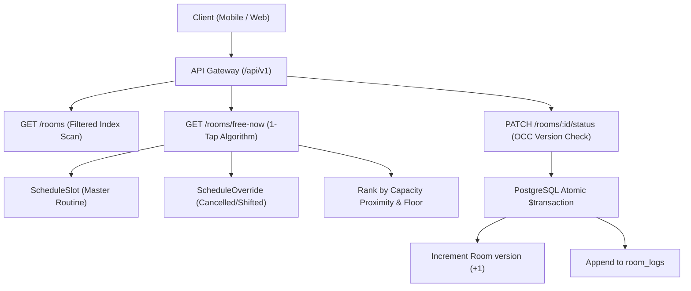

# 📘 Milestone 3: Campus Assets, Room Inventory & Real-Time Availability Engine
> **Language:** 🇬🇧 English | **বাংলা সংস্করণ:** [`milestone_three_bangla.md`](file:///e:/Varsity%20Project/UniRoom-Live/project%20explanation/milestone_three_bangla.md)  
> **Target Audience:** Tanvir (Full-Stack SWE & Academic Defense Candidate)  
> **Status:** `[x]` COMPLETED  
> **File Location:** `project explanation/milestone_three.md`

---

## 📑 Table of Contents
1. [Milestone 3 Architectural Overview & Physical Mental Model](#1-milestone-3-architectural-overview--physical-mental-model)
2. [Physical Hierarchy Modeling (`University` $\to$ `Department` $\to$ `Building` $\to$ `Room`)](#2-physical-hierarchy-modeling-university--department--building--room)
   - [2.1 Building Disambiguation & Campus Names](#21-building-disambiguation--campus-names)
   - [2.2 The Compound Uniqueness Constraint: `[buildingId, roomNumber]`](#22-the-compound-uniqueness-constraint-buildingid-roomnumber)
3. [The High-Performance Room Query Engine (`rooms.service.ts`)](#3-the-high-performance-room-query-engine-roomsservicets)
   - [3.1 Indexed Filtering & Multi-Tenant Query Scoping](#31-indexed-filtering--multi-tenant-query-scoping)
   - [3.2 Live Status Metrics Aggregation (`stats`)](#32-live-status-metrics-aggregation-stats)
4. [The 1-Tap "Find Me a Free Room Now" Algorithmic Engine](#4-the-1-tap-find-me-a-free-room-now-algorithmic-engine)
   - [4.1 Mathematical Interval Overlap Detection](#41-mathematical-interval-overlap-detection)
   - [4.2 Merging Dynamic Schedule Overrides (Cancelled & Shifted Classes)](#42-merging-dynamic-schedule-overrides-cancelled--shifted-classes)
   - [4.3 Smart Room Ranking Heuristic (Capacity Proximity)](#43-smart-room-ranking-heuristic-capacity-proximity)
5. [Optimistic Concurrency Control (OCC) & Audit Logging](#5-optimistic-concurrency-control-occ--audit-logging)
   - [5.1 Why Pessimistic Locking Fails for Modern Web/Mobile Apps](#51-why-pessimistic-locking-fails-for-modern-webmobile-apps)
   - [5.2 Version-Based Atomic Updates in PostgreSQL](#52-version-based-atomic-updates-in-postgresql)
   - [5.3 Immutable Audit Tracking with `RoomLog`](#53-immutable-audit-tracking-with-roomlog)
6. [Line-by-Line Code Breakdown](#6-line-by-line-code-breakdown)
   - [6.1 `UniversitiesController` & `UniversitiesService`](#61-universitiescontroller--universitiesservice)
   - [6.2 `RoomsController` & `RoomsService`](#62-roomscontroller--roomsservice)
7. [End-to-End Request Traces](#7-end-to-end-request-traces)
   - [Trace 1: Querying Available Rooms on 5th Floor](#trace-1-querying-available-rooms-on-5th-floor)
   - [Trace 2: CR Booking a Room with OCC Version Check](#trace-2-cr-booking-a-room-with-occ-version-check)
   - [Trace 3: Two CRs Booking the Same Room Simultaneously (OCC 409 Conflict)](#trace-3-two-crs-booking-the-same-room-simultaneously-occ-409-conflict)
8. [Milestone 3 Interview & Thesis Defense Q&A](#8-milestone-3-interview--thesis-defense-qa)

---

# 1. Milestone 3 Architectural Overview & Physical Mental Model

In university campuses, physical room management is fraught with edge-cases:
* Multiple campuses (e.g. Uttara University Permanent Campus vs. City Campuses).
* Rooms with duplicate numbers in different buildings (e.g. Building A Room 501 vs. Building B Room 501).
* Rooms with combined designations (e.g. `AI Lab 5210 (514)`).
* Class Representatives scrambling between classes looking for a free room to conduct makeup classes or study sessions.

Milestone 3 solves all of these challenges by introducing:
1. **A Normalized Physical Hierarchy**: `University` $\to$ `Department` $\to$ `Building` $\to$ `Room`.
2. **An Indexed Room Inventory**: Sub-millisecond reads with status aggregations.
3. **The 1-Tap Free Room Algorithm**: Eliminates manual routine decoding by automatically calculating slot overlaps and daily cancellations.
4. **Optimistic Concurrency Control (OCC)**: Zero double-booking race conditions without blocking table locks.



---

# 2. Physical Hierarchy Modeling

## 2.1 Building Disambiguation & Campus Names
Located in [`backend/prisma/schema.prisma`](file:///e:/Varsity%20Project/UniRoom-Live/backend/prisma/schema.prisma):

```prisma
model Building {
  id           String      @id @default(uuid())
  departmentId String
  campusName   String      @default("Main Campus") // e.g. "Permanent Campus"
  name         String      // e.g. "Building B"
  createdAt    DateTime    @default(now())
  updatedAt    DateTime    @updatedAt

  department   Department  @relation(fields: [departmentId], references: [id], onDelete: Cascade)
  rooms        Room[]

  @@map("buildings")
}
```

* **`campusName`**: Allows universities with satellite campuses to disambiguate locations cleanly.
* **`onDelete: Cascade`**: If a department or university is deleted, all child buildings and rooms are cleaned up automatically.

---

## 2.2 The Compound Uniqueness Constraint: `[buildingId, roomNumber]`

```prisma
model Room {
  id             String      @id @default(uuid())
  universityId   String
  departmentId   String
  buildingId     String
  roomNumber     String      // e.g. "AI Lab 5210 (514)", "5030 (508)"
  floor          Int         @default(1)
  capacity       Int         @default(40)
  currentStatus  RoomStatus  @default(AVAILABLE)
  version        Int         @default(1) // OCC Lock Version
  ...

  @@unique([buildingId, roomNumber])
  @@index([universityId, departmentId, currentStatus])
  @@map("rooms")
}
```

### Key SWE Principles:
* **`@@unique([buildingId, roomNumber])`**: Guarantees that within "Building B", room number `"5030"` cannot be duplicated. However, "Building A" can also have a room `"5030"` without any database collision!
* **`@@index([universityId, departmentId, currentStatus])`**: A composite B-Tree index specifically tailored for the mobile home screen, enabling instant retrieval of available rooms in the student's department.

---

# 3. The High-Performance Room Query Engine (`rooms.service.ts`)

Located at [`backend/src/modules/rooms/rooms.service.ts`](file:///e:/Varsity%20Project/UniRoom-Live/backend/src/modules/rooms/rooms.service.ts).

### 3.1 Indexed Filtering & Multi-Tenant Query Scoping
```typescript
async getRooms(query: QueryRoomsDto, user?: UserContext) {
  const where: Prisma.RoomWhereInput = {};

  // Multi-tenant scoping: non-super-admins are strictly scoped to their university
  if (user && user.role !== Role.SUPER_ADMIN && user.universityId) {
    where.universityId = user.universityId;
  } else if (query.universityId) {
    where.universityId = query.universityId;
  }

  if (query.departmentId) where.departmentId = query.departmentId;
  if (query.buildingId) where.buildingId = query.buildingId;
  if (query.floor !== undefined) where.floor = query.floor;
  if (query.status) where.currentStatus = query.status;
  if (query.minCapacity) where.capacity = { gte: query.minCapacity };
```
* **Tenant Isolation**: Non-super-admins automatically inherit `user.universityId`. They can never inject a query parameter to browse rooms of another university!

### 3.2 Live Status Metrics Aggregation
Rather than making multiple sequential roundtrips to count available, reserved, and maintenance rooms, we leverage `Promise.all()` to execute the queries concurrently:
```typescript
const [rooms, total, availableCount, runningClassCount, reservedCount, maintenanceCount] =
  await Promise.all([
    this.prisma.room.findMany({ where, skip, take: limit, ... }),
    this.prisma.room.count({ where }),
    this.prisma.room.count({ where: { ...where, currentStatus: RoomStatus.AVAILABLE } }),
    this.prisma.room.count({ where: { ...where, currentStatus: RoomStatus.RUNNING_CLASS } }),
    this.prisma.room.count({ where: { ...where, currentStatus: RoomStatus.RESERVED } }),
    this.prisma.room.count({ where: { ...where, currentStatus: RoomStatus.MAINTENANCE } }),
  ]);
```
This returns the room list along with live summary badges (`stats: { available: 4, runningClass: 0, reserved: 0 }`) in a single network roundtrip.

---

# 4. The 1-Tap "Find Me a Free Room Now" Algorithmic Engine

### 4.1 Mathematical Interval Overlap Detection
A scheduled class slot with time interval $[S_{\text{start}}, S_{\text{end}}]$ overlaps with a user's requested reservation window $[R_{\text{start}}, R_{\text{end}}]$ if and only if:

$$S_{\text{start}} < R_{\text{end}} \quad \land \quad S_{\text{end}} > R_{\text{start}}$$

In TypeScript (`rooms.service.ts`):
```typescript
const hasOverlap = slot.startTime < reqEnd && slot.endTime > reqStart;
```
For example, if a user requests a room from `11:25` to `12:25`:
- A slot running from `11:25` to `12:45` overlaps: $11:25 < 12:25 \land 12:45 > 11:25 \implies \text{True}$ (Room is occupied).
- A slot running from `12:45` to `14:05` does not overlap: $12:45 < 12:25 \implies \text{False}$ (Room is free during the requested window).

---

### 4.2 Merging Dynamic Schedule Overrides
A static routine is not the whole truth. If a class was cancelled today by the faculty member, the room is actually **free**:
```typescript
const isCancelled = slot.overrides.some(
  (o) => o.action === OverrideAction.CANCELLED,
);

if (isCancelled) {
  continue; // Slot was cancelled for today! Room is freed!
}
```
Our algorithm automatically inspects `ScheduleOverride` records for today's date. If a cancellation exists, the overlap is ignored and the room is presented as available!

---

### 4.3 Smart Room Ranking Heuristic (Capacity Proximity)
If a CR needs a room for 30 students, we should recommend a 35-seat room instead of a 100-seat auditorium. We compute capacity proximity:

```typescript
freeRooms.sort((a, b) => {
  const capA = a.room.capacity;
  const capB = b.room.capacity;
  const targetCap = dto.minCapacity || 30;

  const diffA = Math.abs(capA - targetCap);
  const diffB = Math.abs(capB - targetCap);

  if (diffA !== diffB) return diffA - diffB;
  return b.freeMinutesRemaining - a.freeMinutesRemaining;
});
```
This guarantees optimal physical resource utilization on campus.

---

# 5. Optimistic Concurrency Control (OCC) & Audit Logging

## 5.1 Why Pessimistic Locking Fails for Modern Web/Mobile Apps
In traditional databases, you might run `SELECT ... FOR UPDATE` (Pessimistic Lock). This locks database rows on the server. If a mobile user's network stutters while holding a row lock, database connection pools quickly exhaust, crashing the entire backend for all users!

## 5.2 Version-Based Atomic Updates in PostgreSQL
We implement **Optimistic Concurrency Control (OCC)**:
1. Every room has an integer `version` field (starts at `1`).
2. The client fetches the room: `{ id: "uuid-123", version: 1 }`.
3. When changing status (`PATCH /api/v1/rooms/:id/status`), the client sends `{ status: "RESERVED", version: 1 }`.
4. In `rooms.service.ts`:
   ```typescript
   if (room.version !== dto.version) {
     throw new ConflictException(
       `Optimistic Concurrency Lock Conflict: Room status was modified by another user. Your version was ${dto.version}, but current version is ${room.version}. Please refresh and try again.`,
     );
   }
   ```
5. If the version matches, the transaction atomically increments `version: version + 1`.
6. If two CRs click "Reserve" at the exact same millisecond:
   - CR 1 updates version from 1 to 2 $\implies$ Success.
   - CR 2 submits version 1, but database is now at 2 $\implies$ HTTP 409 Conflict. Zero double-bookings!

---

## 5.3 Immutable Audit Tracking with `RoomLog`
Every single status change generates an audit record in the `room_logs` table:
```prisma
model RoomLog {
  id              String      @id @default(uuid())
  roomId          String
  changedByUserId String
  previousStatus  RoomStatus
  newStatus       RoomStatus
  note            String?
  createdAt       DateTime    @default(now())
  ...
}
```
Admins and CRs can call `GET /api/v1/rooms/:id/logs` to see the full audit trail of who changed the room status, when, and why.

---

# 6. Line-by-Line Code Breakdown

## 6.1 `UniversitiesController` & `UniversitiesService`
Located at [`backend/src/modules/universities/`](file:///e:/Varsity%20Project/UniRoom-Live/backend/src/modules/universities/):
* **`findAllUniversities(onlyActive = true)`**: Returns universities with counts of departments, buildings, and rooms in a single optimized query.
* **`createUniversity(dto)`**: Normalizes codes to uppercase (e.g. `UU`), checks uniqueness, and saves operating days.
* **`createDepartment(dto)`**: Enforces compound uniqueness `[universityId, code]`.

## 6.2 `RoomsController` & `RoomsService`
Located at [`backend/src/modules/rooms/`](file:///e:/Varsity%20Project/UniRoom-Live/backend/src/modules/rooms/):
* **`updateRoomStatus(id, dto, userId)`**: Wrapped in a `prisma.$transaction()` to guarantee that the room version increment and the `RoomLog` entry creation succeed together atomically.

---

# 7. End-to-End Request Traces

### Trace 1: Querying Available Rooms on 5th Floor
**Request:** `GET /api/v1/rooms?floor=5&status=AVAILABLE`
1. Request arrives at `RoomsController.getRooms()`.
2. `QueryRoomsDto` validates that `floor = 5` and `status = 'AVAILABLE'`.
3. Prisma executes query on Neon PostgreSQL using the `@@index([universityId, departmentId, currentStatus])` B-Tree index.
4. Returns paginated results with live stats:
   ```json
   {
     "stats": { "total": 4, "available": 4, "runningClass": 0, "reserved": 0, "maintenance": 0 },
     "rooms": [
       { "roomNumber": "AI Lab 5210 (514)", "floor": 5, "capacity": 45, "currentStatus": "AVAILABLE" },
       { "roomNumber": "5030 (508)", "floor": 5, "capacity": 55, "currentStatus": "AVAILABLE" }
     ]
   }
   ```

### Trace 2: CR Booking a Room with OCC Version Check
**Request:** `PATCH /api/v1/rooms/5030-id/status` (Body: `{ status: "RESERVED", version: 1, note: "Batch 68 Class", leaseDurationMinutes: 60 }`)
1. `JwtAuthGuard` & `RolesGuard` verify user is a CR.
2. `RoomsService.updateRoomStatus()` checks `room.version === 1`. Matches!
3. Prisma transaction executes:
   - Sets `currentStatus = 'RESERVED'`.
   - Increments `version = 2`.
   - Sets `leaseExpiresAt = now() + 60 minutes`.
   - Inserts `RoomLog` record with CR user ID.
4. Response returns updated room and audit log.

### Trace 3: Two CRs Booking the Same Room Simultaneously (OCC 409 Conflict)
1. CR 1 and CR 2 both view Room 5030 at `version = 1`.
2. CR 1 clicks Book $\implies$ Server updates Room 5030 to `version = 2`.
3. CR 2 clicks Book 10ms later with `version: 1`.
4. Server checks `room.version (2) !== dto.version (1)`.
5. Server throws:
   ```json
   {
     "success": false,
     "statusCode": 409,
     "error": "Conflict",
     "message": "Optimistic Concurrency Lock Conflict: Room status was modified by another user. Your version was 1, but current version is 2. Please refresh and try again."
   }
   ```
6. Double booking is 100% prevented!

---

# 8. Milestone 3 Interview & Thesis Defense Q&A

### ❓ Question 1: "Why do we model Buildings as a separate entity rather than just a string in the Room model?"
**Answer:**
"A string column creates data redundancy and typographical errors (e.g. 'Bldg B', 'Building-B', 'Building B'). Modeling `Building` as a separate entity enables foreign key constraints, campus disambiguation (`campusName: 'Permanent Campus'`), floor planning, and allows the system to aggregate physical room capacity per building."

### ❓ Question 2: "How does the 1-Tap Algorithm account for cancelled classes?"
**Answer:**
"A static timetable only reflects scheduled slots. In UniRoom-Live, our algorithm queries `ScheduleSlot` and immediately joins active `ScheduleOverride` entries for today's date. If an override with `action == CANCELLED` exists, the algorithm ignores the class slot and recognizes the room as vacant, reflecting live campus reality."

### ❓ Question 3: "Explain how Optimistic Concurrency Control (OCC) prevents race conditions."
**Answer:**
"Under high concurrent traffic, two CRs may attempt to reserve the same room simultaneously. Rather than acquiring expensive database row locks (Pessimistic Locking) which degrade throughput, we use a numeric `version` column. Every status update verifies `WHERE id = :id AND version = :expectedVersion` and increments the version by 1. The first request succeeds, while the second request fails with an HTTP 409 Conflict, completely eliminating double-booking collisions."

### ❓ Question 4: "Why do we use the mathematical formula $S_{\text{start}} < R_{\text{end}} \land S_{\text{end}} > R_{\text{start}}$ for time intervals?"
**Answer:**
"This is Allen's Interval Algebra for interval overlap. Checking whether a start or end time falls inside a window is insufficient because a class might completely encompass the requested window (e.g. class from 10:00 to 14:00, user requests 11:00 to 12:00). The condition $S_{\text{start}} < R_{\text{end}} \land S_{\text{end}} > R_{\text{start}}$ correctly catches all four possible overlap permutations (partial start, partial end, containment, and enclosure)."

### ❓ Question 5: "How does the room query engine ensure multi-tenant isolation?"
**Answer:**
"Our `RoomsService` extracts the authenticated user's `universityId` from the verified JWT payload. Unless the user holds `Role.SUPER_ADMIN`, all database queries automatically inject `where: { universityId: user.universityId }`. A student or CR from one university can never view or modify room assets belonging to another institution."

---
*Next Step: Proceed to [Milestone 4 Handbook](file:///e:/Varsity%20Project/UniRoom-Live/project%20explanation/milestone_four.md) (Super Admin Routine Ingestion & AI Timetable Parsing).*
