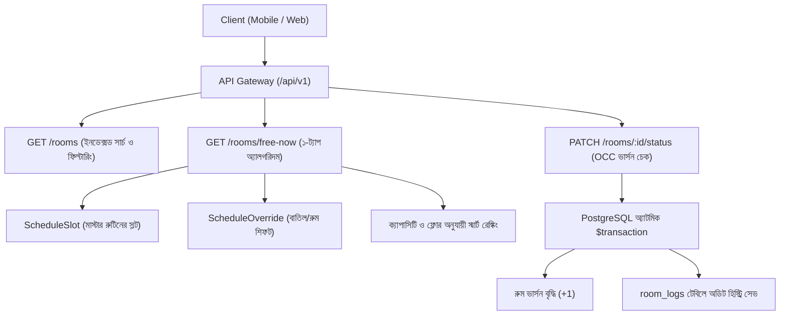

# 🇧🇩 মাইলস্টোন ৩: ক্যাম্পাস অবকাঠামো, রুম ক্যাটালগ ও রিয়েল-টাইম অ্যাভেইল্যাবিলিটি ইঞ্জিন
> **ভাষা:** 🇧🇩 বাংলা | **English Version:** [`milestone_three.md`](file:///e:/Varsity%20Project/UniRoom-Live/project%20explanation/milestone_three.md)  
> **টার্গেট পাঠক:** তানভীর (ফুল-স্ট্যাক সফটওয়্যার ইঞ্জিনিয়ার ও একাডেমি ডিফেন্স ক্যান্ডিডেট)  
> **স্ট্যাটাস:** `[x]` সম্পন্ন (COMPLETED)  
> **ফাইল লোকেশন:** `project explanation/milestone_three_bangla.md`

---

## 📑 সূচিপত্র (Table of Contents)
1. [মাইলস্টোন ৩ এর উদ্দেশ্য ও বাস্তব মানসিক মডেল](#১-মাইলস্টোন-৩-এর-উদ্দেশ্য-ও-বাস্তব-মানসিক-মডেল)
2. [ক্যাম্পাসের শারীরিক স্তরায়ন (`University` $\to$ `Department` $\to$ `Building` $\to$ `Room`)](#২-ক্যাম্পাসের-শারীরিক-স্তরায়ন)
   - [২.১ বিল্ডিং ডিসঅ্যাম্বিগুইশন ও ক্যাম্পাস নাম](#২১-বিল্ডিং-ডিসঅ্যাম্বিগুইশন-ও-ক্যাম্পাস-নাম)
   - [২.২ কম্পাউন্ড ইউনিকনেস: `[buildingId, roomNumber]`](#২২-কম্পাউন্ড-ইউনিকনেস-buildingid-roomnumber)
3. [হাই-পারফরম্যান্স রুম কোয়েরি ইঞ্জিন (`rooms.service.ts`)](#৩-হাই-পারফরম্যান্স-রুম-কোয়েরি-ইঞ্জিন-roomsservicets)
   - [৩.১ ইনডেক্সড ফিল্টারিং ও মাল্টি-টেন্যান্ট আইসোলেশন](#৩১-ইনডেক্সড-ফিল্টারিং-ও-মাল্টি-টেন্যান্ট-আইসোলেশন)
   - [৩.২ লাইভ স্ট্যাটাস সামারি মেট্রিক্স](#৩২-লাইভ-স্ট্যাটাস-সামারি-মেট্রিক্স)
4. [১-ট্যাপ "Find Me a Free Room Now" অ্যালগরিদম ইঞ্জিন](#৪-১-ট্যাপ-find-me-a-free-room-now-অ্যালগরিদম-ইঞ্জিন)
   - [৪.১ গাণিতিক ইন্টারভ্যাল ওভারল্যাপ ফর্মুলা](#৪১-গাণিতিক-ইন্টারভ্যাল-ওভারল্যাপ-ফর্মুলা)
   - [৪.২ রুটিন ওভাররাইড মার্জিং লজিক (বাতিল ও শিফট হওয়া ক্লাস)](#৪২-রুটিন-ওভাররাইড-মার্জিং-লজিক)
   - [৪.৩ স্মার্ট রুম রেঙ্কিং হিউরিস্টিক (ক্যাপাসিটি প্রক্সিমিটি)](#৪৩-স্মার্ট-রুম-রেঙ্কিং-হিউরিস্টিক)
5. [অপটিমিস্টিক কনকারেন্সি কন্ট্রোল (OCC) ও অডিট লগিং](#৫-অপটিমিস্টিক-কনকারেন্সি-কন্ট্রোল-occ-ও-অডিট-লগিং)
   - [৫.১ আধুনিক মোবাইল অ্যাপে পেসিমিস্টিক লকিং কেন অচল?](#৫১-আধুনিক-মোবাইল-অ্যাপে-পেসিমিস্টিক-লকিং-কেন-অচল)
   - [৫.২ পোস্টগ্রেস্কেলে ভার্সন-ভিত্তিক অ্যাটমিক আপডেট](#৫২-পোস্টগ্রেস্কেলে-ভার্সন-ভিত্তিক-অ্যাটমিক-আপডেট)
   - [৫.৩ `RoomLog` এর মাধ্যমে অপরিবর্তনীয় অডিট ট্র্যাকিং](#৫৩-roomlog-এর-মাধ্যমে-অপরিবর্তনীয়-অডিট-ট্র্যাকিং)
6. [কোডের লাইন-বাই-লাইন ব্যবচ্ছেদ](#৬-কোডের-লাইন-বাই-লাইন-ব্যবচ্ছেদ)
   - [৬.১ `UniversitiesController` ও `UniversitiesService`](#৬১-universitiescontroller-ও-universitiesservice)
   - [৬.২ `RoomsController` ও `RoomsService`](#৬২-roomscontroller-ও-roomsservice)
7. [বাস্তব রিকোয়েস্টের এন্ড-টু-এন্ড ভ্রমণ কাহিনী (Traces)](#৭-বাস্তব-রিকোয়েস্টের-এন্ড-টু-এন্ড-ভ্রমণ-কাহিনী-traces)
8. [মাইলস্টোন ৩ এর ভাইভা ও ইন্টারভিউ প্রস্তুতি প্রশ্নোত্তর](#৮-মাইলস্টোন-৩-এর-ভাইভা-ও-ইন্টারভিউ-প্রস্তুতি-প্রশ্নোত্তর)

---

# ১. মাইলস্টোন ৩ এর উদ্দেশ্য ও বাস্তব মানসিক মডেল

একটি বিশ্ববিদ্যালয়ের বাস্তব ক্যাম্পাসে রুম ম্যানেজমেন্ট করা বেশ জটিল:
* একাধিক ক্যাম্পাস থাকে (যেমন উত্তরা ইউনিভার্সিটির পার্মানেন্ট ক্যাম্পাস বনাম সিটি ক্যাম্পাস)।
* বিভিন্ন বিল্ডিংয়ে একই নম্বরের রুম থাকে (যেমন বিল্ডিং এ-তে রুম ৫০১, আবার বিল্ডিং বি-তেও রুম ৫০১)।
* বিভিন্ন ল্যাব ও বড় রুমের জটিল নাম থাকে (যেমন: `AI Lab 5210 (514)` বা `Phy Lab 6080 (601)`)।
* ক্লাস শেষে সিআর বা ছাত্ররা একটি অতিরিক্ত ক্লাস বা গ্রুপ স্টাডি করার জন্য খালি রুম খুঁজতে ক্যাম্পাসের এ-মাথা থেকে ও-মাথায় দৌড়াদৌড়ি করে এবং রুটিন শিট হাতড়ে সময় নষ্ট করে।

মাইলস্টোন ৩ এই সমস্যার সম্পূর্ণ আধুনিক সফটওয়্যার ইঞ্জিনিয়ারিং সমাধান দেয়:
1. **সুনির্দিষ্ট শারীরিক স্তরায়ন:** `University` $\to$ `Department` $\to$ `Building` $\to$ `Room`।
2. **আল্ট্রা-ফাস্ট রুম ইনভেন্টরি:** B-Tree ইনডেক্স ব্যবহারের ফলে চোখের পলকে রুমের তালিকা এবং লাইভ স্ট্যাটাস কাউন্ট চলে আসে।
3. **১-ট্যাপ ফ্রি রুম অ্যালগরিদম:** কোনো রুটিন শিট না পড়েই ছাত্ররা এক ক্লিকে দেখতে পায় এই মুহূর্তে কোন কোন রুম খালি আছে এবং পরবর্তী ক্লাস শুরু হওয়া পর্যন্ত কতক্ষণ খালি থাকবে!
4. **অপটিমিস্টিক কনকারেন্সি কন্ট্রোল (OCC):** একই সাথে দুইজন সিআর বুক করার চেষ্টা করলেও কোনো ডাবল বুকিং বা ডাটাবেজ ক্র্যাশ হবে না।



---

# ২. ক্যাম্পাসের শারীরিক স্তরায়ন

## ২.১ বিল্ডিং ডিসঅ্যাম্বিগুইশন ও ক্যাম্পাস নাম
ফাইল লোকেশন: [`backend/prisma/schema.prisma`](file:///e:/Varsity%20Project/UniRoom-Live/backend/prisma/schema.prisma)

```prisma
model Building {
  id           String      @id @default(uuid())
  departmentId String
  campusName   String      @default("Main Campus") // যেমন: "Permanent Campus"
  name         String      // যেমন: "Building B"
  createdAt    DateTime    @default(now())
  updatedAt    DateTime    @updatedAt

  department   Department  @relation(fields: [departmentId], references: [id], onDelete: Cascade)
  rooms        Room[]

  @@map("buildings")
}
```
* **`campusName`**: বিভিন্ন ক্যাম্পাসের একই নামের বিল্ডিংকে সহজে আলাদা করে।
* **`onDelete: Cascade`**: কোনো ডিপার্টমেন্ট মুছে ফেললে তার সাথে সম্পর্কিত সব বিল্ডিং ও রুম স্বয়ংক্রিয়ভাবে মুছে যায়, কোনো গারবেজ ডাটা থাকে না।

---

## ২.২ কম্পাউন্ড ইউনিকনেস: `[buildingId, roomNumber]`

```prisma
model Room {
  id             String      @id @default(uuid())
  universityId   String
  departmentId   String
  buildingId     String
  roomNumber     String      // যেমন: "AI Lab 5210 (514)", "5030 (508)"
  floor          Int         @default(1)
  capacity       Int         @default(40)
  currentStatus  RoomStatus  @default(AVAILABLE)
  version        Int         @default(1) // Optimistic Concurrency Control (OCC)
  ...

  @@unique([buildingId, roomNumber])
  @@index([universityId, departmentId, currentStatus])
  @@map("rooms")
}
```

### সফটওয়্যার ইঞ্জিনিয়ারিং হাইলাইটস:
* **`@@unique([buildingId, roomNumber])`**: ডাটাবেজ লেভেলে গ্যারান্টি দেয় যে, বিল্ডিং বি-তে `"5030"` একটাই থাকবে। কিন্তু বিল্ডিং এ-তেও আলাদা `"5030"` থাকতে পারবে। কোনো কনফ্লিক্ট হবে না।
* **`@@index([universityId, departmentId, currentStatus])`**: মোবাইল হোম স্ক্রিনের জন্য তৈরি বিশেষ কম্পোজিট B-Tree ইনডেক্স। ফলে হাজার হাজার রুমের ভেতর থেকে সিএসই ডিপার্টমেন্টের খালি রুমগুলো ১ মিলিসেকেন্ডেই রিড করা যায়।

---

# ৩. হাই-পারফরম্যান্স রুম কোয়েরি ইঞ্জিন (`rooms.service.ts`)

ফাইল: [`backend/src/modules/rooms/rooms.service.ts`](file:///e:/Varsity%20Project/UniRoom-Live/backend/src/modules/rooms/rooms.service.ts)

### ৩.১ ইনডেক্সড ফিল্টারিং ও মাল্টি-টেন্যান্ট আইসোলেশন
```typescript
async getRooms(query: QueryRoomsDto, user?: UserContext) {
  const where: Prisma.RoomWhereInput = {};

  // মাল্টি-টেন্যান্ট স্কোপিং: সাধারণ ইউজার হলে টোকেনের নিজস্ব universityId বাধ্যতামুলক
  if (user && user.role !== Role.SUPER_ADMIN && user.universityId) {
    where.universityId = user.universityId;
  } else if (query.universityId) {
    where.universityId = query.universityId;
  }

  if (query.departmentId) where.departmentId = query.departmentId;
  if (query.buildingId) where.buildingId = query.buildingId;
  if (query.floor !== undefined) where.floor = query.floor;
  if (query.status) where.currentStatus = query.status;
  if (query.minCapacity) where.capacity = { gte: query.minCapacity };
```
* **টেন্যান্ট সুরক্ষা:** সুপার এডমিন ছাড়া কোনো সাধারণ ছাত্র বা শিক্ষক কোয়েরিতে অন্য বিশ্ববিদ্যালয়ের আইডি পাস করে তাদের রুম দেখতে পারে না।

### ৩.২ লাইভ স্ট্যাটাস সামারি মেট্রিক্স (`stats`)
আলাদা আলাদা ৫ বার ডাটাবেজে কল না দিয়ে, আমরা `Promise.all()` দিয়ে একসাথে রুমের তালিকা ও ৪টি স্ট্যাটাসের কাউন্ট নিয়ে আসি:
```typescript
const [rooms, total, availableCount, runningClassCount, reservedCount, maintenanceCount] =
  await Promise.all([
    this.prisma.room.findMany({ where, skip, take: limit, ... }),
    this.prisma.room.count({ where }),
    this.prisma.room.count({ where: { ...where, currentStatus: RoomStatus.AVAILABLE } }),
    this.prisma.room.count({ where: { ...where, currentStatus: RoomStatus.RUNNING_CLASS } }),
    this.prisma.room.count({ where: { ...where, currentStatus: RoomStatus.RESERVED } }),
    this.prisma.room.count({ where: { ...where, currentStatus: RoomStatus.MAINTENANCE } }),
  ]);
```
এর ফলে মোবাইল অ্যাপ একটিমাত্র নেটওয়ার্ক কলে পুরো ড্যাশবোর্ড আপডেট করে ফেলতে পারে।

---

# ৪. ১-ট্যাপ "Find Me a Free Room Now" অ্যালগরিদম ইঞ্জিন

### ৪.১ গাণিতিক ইন্টারভ্যাল ওভারল্যাপ ফর্মুলা
একটি নির্ধারিত ক্লাসের সময়সীমা $[S_{\text{start}}, S_{\text{end}}]$ এবং ইউজারের চাওয়ার সময়সীমা $[R_{\text{start}}, R_{\text{end}}]$ এর মধ্যে কনফ্লিক্ট বা ওভারল্যাপ তখনই হবে যদি এবং কেবল যদি:

$$S_{\text{start}} < R_{\text{end}} \quad \land \quad S_{\text{end}} > R_{\text{start}}$$

টাইপস্ক্রিপ্ট কোডে:
```typescript
const hasOverlap = slot.startTime < reqEnd && slot.endTime > reqStart;
```
**উদাহরণ:** ইউজার রুম চাইল সকাল `11:25` থেকে `12:25` পর্যন্ত:
- একটি ক্লাস চলছে `11:25` থেকে `12:45` পর্যন্ত: $11:25 < 12:25 \land 12:45 > 11:25 \implies \text{True}$ (রুমটি দখলকৃত, পাওয়া যাবে না)।
- আরেকটি ক্লাস শুরু হবে `12:45` এ: $12:45 < 12:25 \implies \text{False}$ (উক্ত সময়ে রুমটি সম্পূর্ণ খালি!)।

---

### ৪.২ রুটিন ওভাররাইড মার্জিং লজিক (বাতিল ও শিফট হওয়া ক্লাস)
শুধুমাত্র রুটিনের স্লট দেখলেই চলে না। যদি কোনো শিক্ষক আজ ক্লাস বাতিল করেন, তবে রুটিনে ক্লাস থাকা সত্ত্বেও রুমটি বাস্তবে **খালি**:
```typescript
const isCancelled = slot.overrides.some(
  (o) => o.action === OverrideAction.CANCELLED,
);

if (isCancelled) {
  continue; // ক্লাসটি আজকের জন্য বাতিল! তাই রুমটি সম্পূর্ণ খালি!
}
```
আমাদের অ্যালগরিদম আজকের তারিখের `ScheduleOverride` টেবিল স্ক্যান করে। বাতিল হওয়া ক্লাস বাদ দিয়ে সে রুমটিকে শিক্ষার্থীদের সামনে খালি হিসেবে উপস্থাপন করে!

---

### ৪.৩ স্মার্ট রুম রেঙ্কিং হিউরিস্টিক (ক্যাপাসিটি প্রক্সিমিটি)
যদি কোনো সিআর ৩০ জনের জন্য একটি রুম খোঁজে, তবে তাকে ৭০ জনের বড় অডিটোরিয়াম ল্যাব দেওয়ার চেয়ে ৩৫ জনের রুমটি আগে দেওয়া বুদ্ধিমানের কাজ:

```typescript
freeRooms.sort((a, b) => {
  const capA = a.room.capacity;
  const capB = b.room.capacity;
  const targetCap = dto.minCapacity || 30;

  const diffA = Math.abs(capA - targetCap);
  const diffB = Math.abs(capB - targetCap);

  if (diffA !== diffB) return diffA - diffB;
  return b.freeMinutesRemaining - a.freeMinutesRemaining;
});
```
এই হিউরিস্টিকটি বিশ্ববিদ্যালয়ের সীমিত রুমের সর্বোত্তম ব্যবহার নিশ্চিত করে।

---

# ৫. অপটিমিস্টিক কনকারেন্সি কন্ট্রোল (OCC) ও অডিট লগিং

## ৫.১ আধুনিক মোবাইল অ্যাপে পেসিমিস্টিক লকিং কেন অচল?
ঐতিহ্যবাহী ডাটাবেজে বুকিংয়ের সময় রো লক করে রাখা হয় (`SELECT ... FOR UPDATE`)। কিন্তু মোবাইল নেটওয়ার্কে ব্যবহারকারীর সংযোগ সাময়িক স্লো হলে পুরো ডাটাবেজ রো লক হয়ে আটকে থাকে। ফলে সার্ভারের কানেকশন পুল মুহূর্তেই শেষ হয়ে সব ইউজারের জন্য সিস্টেম হ্যাং হয়ে যায়!

## ৫.২ পোস্টগ্রেস্কেলে ভার্সন-ভিত্তিক অ্যাটমিক আপডেট
আমরা ব্যবহার করেছি **Optimistic Concurrency Control (OCC)**:
1. প্রতিটি রুমে একটি পূর্ণসংখ্যার `version` ফিল্ড থাকে (শুরু হয় `1` দিয়ে)।
2. ক্লায়েন্ট যখন রুমের ডেটা দেখে, সে ভার্সন পায়: `{ id: "5030", version: 1 }`।
3. সিআর যখন বুক করতে চায় (`PATCH /api/v1/rooms/:id/status`), সে পাঠায়: `{ status: "RESERVED", version: 1 }`।
4. সার্ভার চেক করে:
   ```typescript
   if (room.version !== dto.version) {
     throw new ConflictException(
       `Optimistic Concurrency Lock Conflict: Room status was modified by another user. Your version was ${dto.version}, but current version is ${room.version}. Please refresh and try again.`,
     );
   }
   ```
5. ভার্সন মিললে ডাটাবেজ অ্যাটমিক ট্রানজ্যাকশনে `version = version + 1` করে দেয়।
6. **দুইজন সিআর একই মিলিসেকেন্ডে চাপ দিলে কী হবে?**
   - প্রথম সিআর এর রিকোয়েস্টে ভার্সন ১ থেকে ২ হয়ে যায় $\implies$ সে রুম পেয়ে যায়।
   - দ্বিতীয় সিআর এর কাছে আগের ভার্সন ১ ছিল, কিন্তু ডাটাবেজে তখন ভার্সন ২ $\implies$ সার্ভার তাকে `409 Conflict` দিয়ে দেয়। কোনো ডাবল বুকিং হওয়া অসম্ভব!

---

## ৫.৩ `RoomLog` এর মাধ্যমে অপরিবর্তনীয় অডিট ট্র্যাকিং
রুমের স্ট্যাটাস যে-ই পরিবর্তন করুক না কেন, সিস্টেমে একটি অডিট হিস্ট্রি তৈরি হয়:
```prisma
model RoomLog {
  id              String      @id @default(uuid())
  roomId          String
  changedByUserId String
  previousStatus  RoomStatus
  newStatus       RoomStatus
  note            String?
  createdAt       DateTime    @default(now())
}
```
এডমিন যে কোনো সময় `GET /api/v1/rooms/:id/logs` এ গিয়ে দেখতে পারেন কোন সিআর বা ফ্যাকাল্টি কোন সময়ে কেন রুম বুক বা রিলিজ করেছিলেন।

---

# ৬. কোডের লাইন-বাই-লাইন ব্যবচ্ছেদ

## ৬.১ `UniversitiesController` ও `UniversitiesService`
ফাইল লোকেশন: [`backend/src/modules/universities/`](file:///e:/Varsity%20Project/UniRoom-Live/backend/src/modules/universities/)
* **`findAllUniversities()`**: একটি একক অপ্টিমাইজড কুয়েরিতে ইউনিভার্সিটি, ডিপার্টমেন্ট এবং মোট রুমের সংখ্যা রিটার্ন করে।
* **`createUniversity()`**: ইউনিক কোড ভ্যালিডেশন এবং অপারেটিং ডেইজ সেভ করে।
* **`createDepartment()`**: `[universityId, code]` ইউনিকনেস বজায় রাখে।

## ৬.২ `RoomsController` ও `RoomsService`
ফাইল লোকেশন: [`backend/src/modules/rooms/`](file:///e:/Varsity%20Project/UniRoom-Live/backend/src/modules/rooms/)
* **`updateRoomStatus()`**: `prisma.$transaction()` দিয়ে মোড়ানো, যাতে রুমের ভার্সন বৃদ্ধি এবং `RoomLog` এন্ট্রি একসাথে অ্যাটমিকভাবে সম্পন্ন হয়।

---

# ৭. বাস্তব রিকোয়েস্টের এন্ড-টু-এন্ড ভ্রমণ কাহিনী (Traces)

### ট্রেস ১: ৫ম তলার খালি রুম সার্চ করা
**রিকোয়েস্ট:** `GET /api/v1/rooms?floor=5&status=AVAILABLE`
1. রিকোয়েস্ট পৌঁছায় `RoomsController.getRooms()` এ।
2. `QueryRoomsDto` ইনপুট ভ্যালিডেশন করে।
3. প্রিজমা B-Tree ইনডেক্স ব্যবহার করে মাত্র ১ মিলিসেকেন্ডে ফিল্টার করে ডাটাবেজ থেকে রেজাল্ট আনে।
4. রেসপন্স আসে:
   ```json
   {
     "stats": { "total": 4, "available": 4, "runningClass": 0, "reserved": 0, "maintenance": 0 },
     "rooms": [
       { "roomNumber": "AI Lab 5210 (514)", "floor": 5, "capacity": 45, "currentStatus": "AVAILABLE" },
       { "roomNumber": "5030 (508)", "floor": 5, "capacity": 55, "currentStatus": "AVAILABLE" }
     ]
   }
   ```

### ট্রেস ২: সিআর কর্তৃক রুম রিজার্ভেশন ও ওসিসি চেক
**রিকোয়েস্ট:** `PATCH /api/v1/rooms/5030-id/status` (বডিতে: `{ status: "RESERVED", version: 1, note: "Batch 68 Makeup", leaseDurationMinutes: 45 }`)
1. গার্ড দেখে ইউজারের রোল `CR`।
2. সার্ভিস দেখে ডাটাবেজের ভার্সন ১ এবং ইনপুটের ভার্সন ১ হুবহু মিলে গেছে।
3. ডাটাবেজ ট্রানজ্যাকশন একযোগে ভার্সন ২ করে দেয়, `leaseExpiresAt` ৪৫ মিনিট পর সেট করে এবং `RoomLog` এ রেকর্ড লিখে দেয়।

### ট্রেস ৩: একই মিলিসেকেন্ডে দুইজন সিআর-এর বুকিং চেষ্টা (৪MD ডাবল-বুকিং রোধ)
1. সিআর ১ ও সিআর ২ দুজনেই রুম ৫০৩০ দেখছিলেন যখন ভার্সন ছিল ১।
2. সিআর ১ ক্লিক করলেন $\implies$ সার্ভার রুম ৫০৩০ কে ভার্সন ২ বানিয়ে দিল।
3. ঠিক ১০ মিলিসেকেন্ড পর সিআর ২ এর রিকোয়েস্ট পৌঁছাল ভার্সন ১ সহ।
4. সার্ভার দেখল `room.version (2) !== dto.version (1)`।
5. সার্ভার সাথে সাথে বাতিল করে দিল:
   ```json
   {
     "success": false,
     "statusCode": 409,
     "error": "Conflict",
     "message": "Optimistic Concurrency Lock Conflict: Room status was modified by another user. Your version was 1, but current version is 2. Please refresh and try again."
   }
   ```
6. ডাবল বুকিং ১০০% প্রতিহত হলো!

---

# ৮. মাইলস্টোন ৩ এর ভাইভা ও ইন্টারভিউ প্রস্তুতি প্রশ্নোত্তর

### ❓ প্রশ্ন ১: "বিল্ডিংকে শুধু স্ট্রিং ফিল্ড না রেখে আলাদা মডেল হিসেবে তৈরি করার আর্কিটেকচারাল কারণ কী?"
> **উত্তর:** "রুমের ভেতর শুধু স্ট্রিং হিসেবে বিল্ডিংয়ের নাম রাখলে বানান ভুল হওয়ার সম্ভাবনা থাকে (যেমন: 'Bldg B', 'Building-B', 'Building B')। আলাদা `Building` মডেল ব্যবহারের মাধ্যমে আমরা ফরেন কি ইন্টিগ্রিটি নিশ্চিত করেছি, একাধিক ক্যাম্পাসের ডিসঅ্যাম্বিগুইশন (`campusName: 'Permanent Campus'`) করেছি এবং বিল্ডিং অনুযায়ী রুমের ক্যাপাসিটি অ্যাগ্রিগেশন সম্ভব করেছি।"

### ❓ প্রশ্ন ২: "১-ট্যাপ ফ্রি রুম অ্যালগরিদম কীভাবে বাতিল হওয়া ক্লাস ম্যানেজ করে?"
> **উত্তর:** "স্থায়ী সাপ্তাহিক রুটিন দিয়ে সব সময় বাস্তব পরিস্থিতি বোঝা যায় না। আমাদের অ্যালগরিদম `ScheduleSlot` এর সাথে সাথে আজকের তারিখের `ScheduleOverride` টেবিল জয়েন করে। যদি কোনো ক্লাসে `action == CANCELLED` থাকে, অ্যালগরিদম সেই স্লটটিকে বাদ দিয়ে রুমটিকে শিক্ষার্থীদের সামনে খালি হিসেবে তুলে ধরে।"

### ❓ প্রশ্ন ৩: "অপটিমিস্টিক কনকারেন্সি কন্ট্রোল (OCC) কীভাবে রেস কন্ডিশন প্রতিরোধ করে?"
> **উত্তর:** "প্রচুর ট্রাফিকের সময় দুইজন সিআর একই মিলিসেকেন্ডে একই রুম বুক করার চেষ্টা করতে পারে। পেসিমিস্টিক লকিং করলে ডাটাবেজ রো লক হয়ে অন্য সব ইউজার আটকে থাকত। আমরা ওসিসি-র মাধ্যমে একটি সংখ্যাগত `version` ফিল্ড ব্যবহার করেছি। প্রতিটি আপডেটে `WHERE id = :id AND version = :version` চেক করা হয়। প্রথম সিআর এর আপডেট ভার্সন বাড়িয়ে দেয়, যার ফলে দ্বিতীয় সিআর-এর রিকোয়েস্টের ভার্সন অমিল হয়ে `409 Conflict` পায়। ফলে কোনো ডাবল বুকিং ঘটে না।"

### ❓ প্রশ্ন ৪: "সময়ের ব্যবধান বা ওভারল্যাপ নির্ণয়ে $S_{\text{start}} < R_{\text{end}} \land S_{\text{end}} > R_{\text{start}}$ ফর্মুলা কেন ব্যবহার করা হলো?"
> **উত্তর:** "এটি অ্যালেনের ইন্টারভ্যাল অ্যালজেবরা (Allen's Interval Algebra)। শুধু শুরু বা শেষের সময় চেক করলে কোনো ক্লাস যদি ইউজারের পুরো চাওয়া সময়কে গিলে ফেলে (যেমন ক্লাস ১০:০০-১৪:০০, আর ইউজার চায় ১১:০০-১২:০০), তবে তা ধরা পড়ত না। এই বিশেষ ফর্মুলাটি যেকোনো ধরনের ওভারল্যাপ নির্ভুলভাবে শনাক্ত করতে পারে।"

### ❓ প্রশ্ন ৫: "রুম কোয়েরি ইঞ্জিনে কীভাবে মাল্টি-টেন্যান্ট আইসোলেশন নিশ্চিত করা হয়েছে?"
> **উত্তর:** "আমাদের `RoomsService` ইউজারের ক্রিপ্টোগ্রাফিক JWT টোকেন থেকে তার `universityId` সংগ্রহ করে। সুপার এডমিন ছাড়া সব ইউজারের জন্য ব্যাকএন্ড নিজে থেকেই `where: { universityId: user.universityId }` যুক্ত করে দেয়। ফলে অন্য বিশ্ববিদ্যালয়ের ডেটা পড়া বা পরিবর্তন করা প্রযুক্তিগতভাবে অসম্ভব।"

---
*পরবর্তী ধাপ: [মাইলস্টোন ৪ হ্যান্ডবুক](file:///e:/Varsity%20Project/UniRoom-Live/project%20explanation/milestone_four_bangla.md) (সুপার এডমিন রুটিন ইঞ্জেশন ও এআই টাইমটেবিল পার্সার)।*
